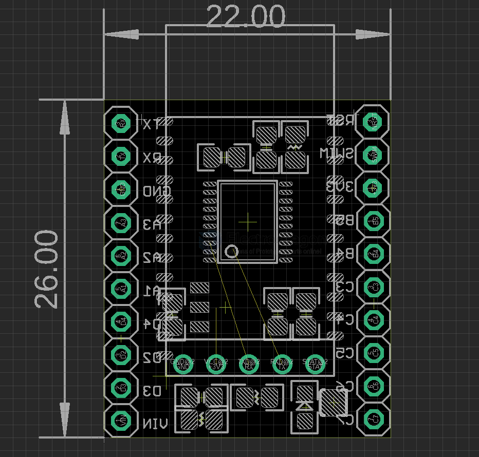
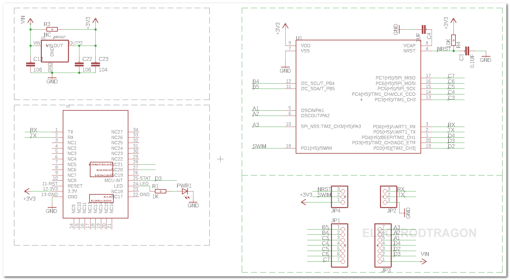

# NBL1064-dat

## Info

[product url - Bluetooth IO Control Board EDR 2.0, BLK_IO](https://www.electrodragon.com/product/bluetooth-io-control-board-edr-2-0-blk_io/)

## Board Map, Dimension, Pins, chip info, Use Guide, Setup Jumper, etc.

- [[BT-dual-mode-dat]] - [[bluetooth-dat]] - [[BT-SPP-dat]] - [[EY-23A-dat]] - [[EY-34-dat]]

on board chip [[STM8-dat]] - [[MCU-dat]] - demo code find at [[STM8-SDK-dat]]

### Board V2 

- [[BT-dual-mode-dat]] supported 

serial communications 

- 2 `UART1_TX`/AIN5/HS PD5
- 3 `UART1_RX`/AIN6/HS PD6
- module ATC == - 17 PC7 (HS)/SPI_MISO [TIM1_CH2]1 

## Applications, category, tags, etc. 

## Demo Code and Video

## ref 

- [[NBL1064]] 

- [legacy wiki page ](https://www.electrodragon.com/w/BLK_IO)

https://www.electrodragon.com/w/Category:Bluetooth_2.0#AT_Commands

- [[rf-star-dat]]