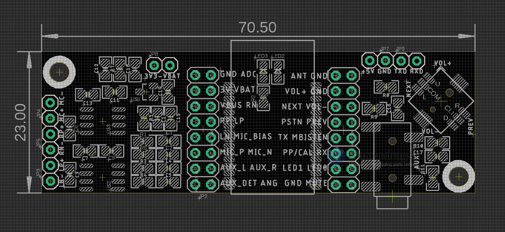
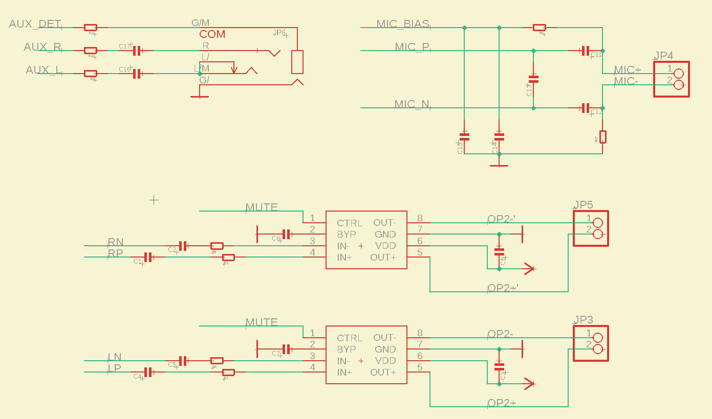
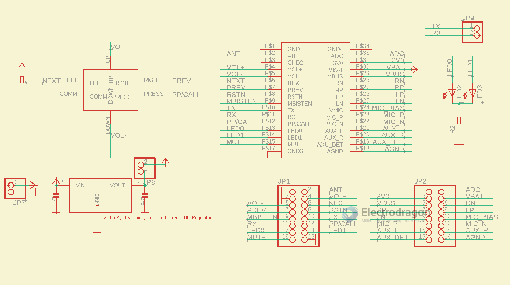
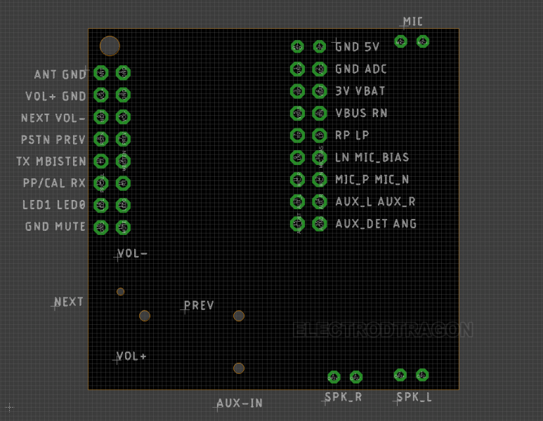

# NBL1097-dat 

BK8000D BT Bluetooth SPP + Audio HPF Player

https://www.electrodragon.com/product/bk8000d-bt-bluetooth-spp-audio-hpf-player/

## Pins V2 

* Notice middle press for PP/CAL = pause and play function.
* Battery read on connected phone is about 20% battery fixed, because on board LDO output 3.3V for core module. No need worry.

## SCH 

1. Peripheral SCH 

- AUX
- MIC
- SPK x 2 

2. Core board SCH 

## Status
* Left LED normal blink = booting
* two LED blink in turns = searching and pairing
* Left LED slow blink = connected 

## Version Logs

## Pins V1

## ref 
