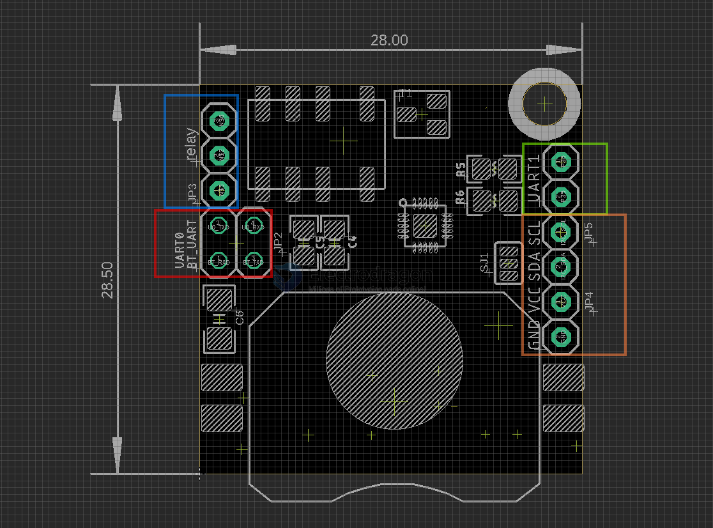

# NBL1107-dat

https://www.electrodragon.com/product/ble-5-0-mesh-sensor-node-mini-board-mesh-node/

legacy wiki page - https://w.electrodragon.com/w/Mesh-Node

## Board Map 

- SJ1 setup button output to either Reset or P32

## ref 

- [[AHT20-dat]] - [[KX023-1025-dat]]

- [[HC32F003-dat]] - [[HDSC-dat]]

- [[JDY-25M-dat]] - [[signal-relay-dat]]

- [[NBL1107]]