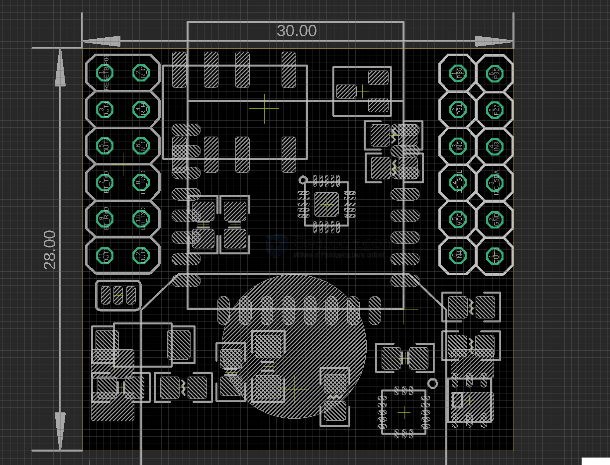

# NBL1107-dat

[BLE 5.0 Mesh Sensor Node Mini Board Mesh-Node](https://www.electrodragon.com/product/ble-5-0-mesh-sensor-node-mini-board-mesh-node/)

legacy wiki page - https://w.electrodragon.com/w/Mesh-Node

- [[BLE-dat]] - [[bluetooth-dat]]

- [[EY-25M-dat]] - [[BLE-dat]] - [[BLE5-dat]] - [[ibeacon-dat]] - [[mesh-node-dat]]

## Board Map 

board version V2

- SJ1 setup button output to either Reset or P32

### Pin Definitions

| left 1     |     | left 2 |              | right 1 |     | right 2 |     |
| ---------- | --- | ------ | ------------ | ------- | --- | ------- | --- |
| RESETB/P00 |     | R_O    | relay open   | P36     | MCU | P35     | MCU |
| OUT4       | BT  | R_M    | relay middle | P31     | MCU | P27     | MCU |
| OUT3       | BT  | R_C    | relay close  | IN5     | BT  | IN3     | BT  |
| BT_TXD     |     | UO_RXD |              | I2C_SCL |     | I2C_SDA |     |
| BT_RXD     |     | UO_TXD |              | VCC     |     | GND     |     |
| OUT1       | BT  | OUT5   | BT           | IN4     | BT  | OUT2    | BT  |

| MCU pins   | BT Modules | Sensors    | Other                |
| ---------- | ---------- | ---------- | -------------------- |
| Reset      |            |            | Button Reset or PROG |
| U0_TXD     | BT_RXD     |            |                      |
| U0_RXD     | BT_TXD     |            |                      |
| P03        | -          | -          | NC                   |
| P15        | BT_IN2     |            |                      |
| P14        | BT_IN1     |            |                      |
| P23        | BT_stat    |            |                      |
| P24        |            |            | Button Alternative   |
| P25        |            | Sensor SDA |                      |
| P26        |            | Sensor SCL |                      |
| P27        |            |            | lead out free        |
| P31        |            |            | lead out free        |
| P32        | BT_PWRC    |            |                      |
| P33        |            |            | Bat_ADC              |
| P34        |            |            | Relay                |
| P35_U1_TXD |            |            | free or PROG         |
| P36_U1_RXD |            |            | free or PROG         |

## logs 

board version V1 

## ref 

- [[AHT20-dat]] - [[KX023-1025-dat]] - [[I2C-dat]]

- [[HC32F003-dat]] - [[HDSC-dat]]

- [[EY-25M-dat]] - [[relay-signal-dat]] - [[relay-dat]]

- [[NBL1107]]