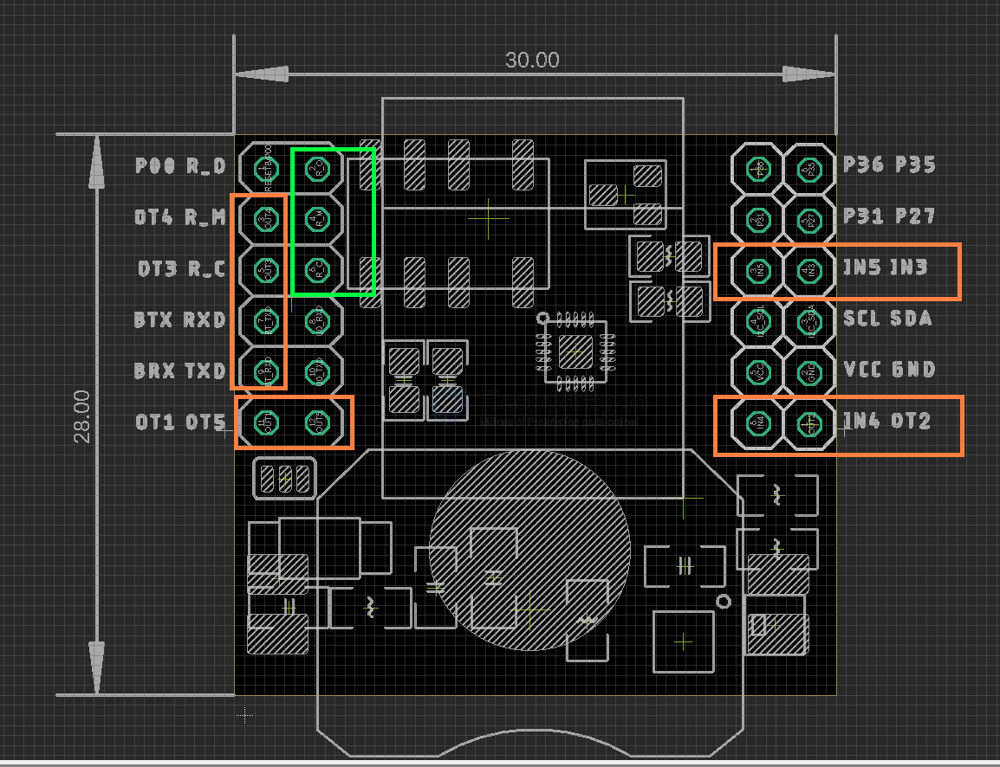
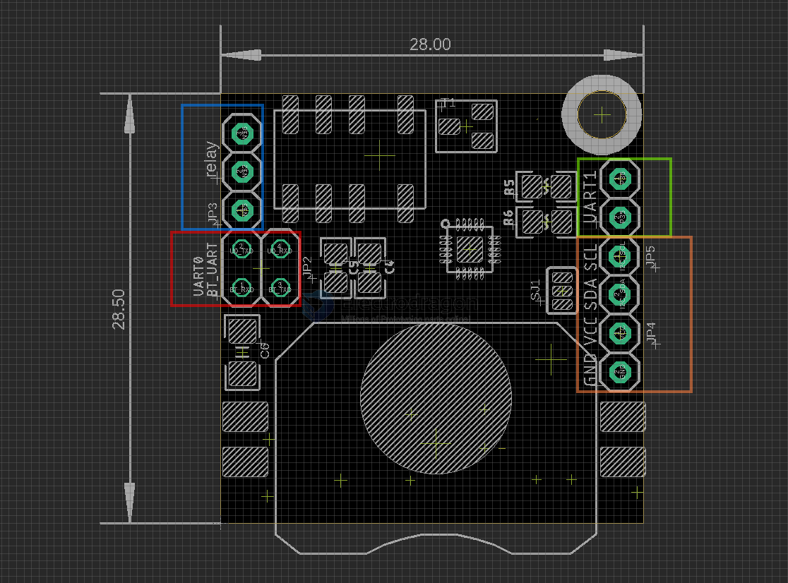
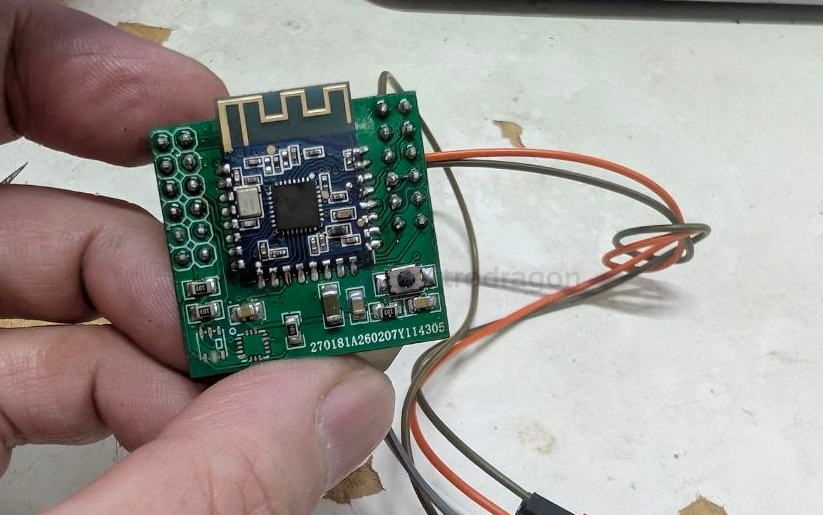
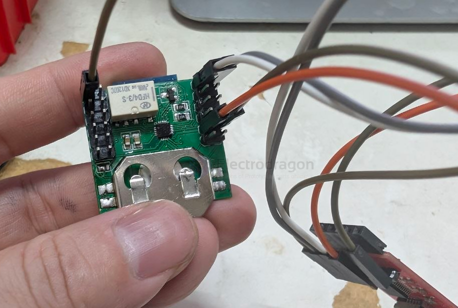
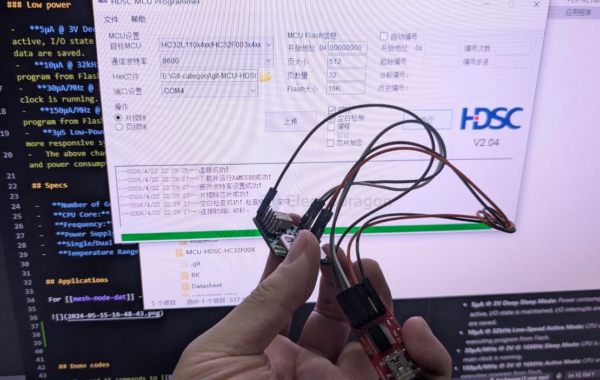

# NBL1107-dat

[BLE 5.0 Mesh Sensor Node Mini Board Mesh-Node](https://www.electrodragon.com/product/ble-5-0-mesh-sensor-node-mini-board-mesh-node/)

[legacy wiki page](https://w.electrodragon.com/w/Mesh-Node) 

- [[BLE-dat]] - [[bluetooth-dat]] - [[ibeacon-dat]] - [[mesh-node-dat]] - [[NBL1107-dat]] - [[NBL1101-dat]]

- [[EY-25M-dat]] - [[BLE-dat]] - [[BLE5-dat]] - [[ibeacon-dat]] - [[mesh-node-dat]] - [[NBL1101-dat]]

- [[HDSC-dat]] - [[HC32F003-dat]] - [[HDSC-SDK-dat]] - [[NBL1107-dat]] - [[C-dat]]

- [[AHT20-dat]] - [[KX023-1025-dat]] - [[I2C-dat]]

- [[relay-signal-dat]] - [[relay-dat]]

## Board Map board version V2

green box == [[relay-signal-dat]] // orange box == BT module [[NBL1101-dat]] // the rest == [[MCU-dat]] - [[HC32F003-dat]]

- SJ1 setup button output to either Reset or P32

### Pin Definitions

| left 1     |     | left 2 |              | right 1 |     | right 2 |     |
| ---------- | --- | ------ | ------------ | ------- | --- | ------- | --- |
| RESETB/P00 |     | R_O    | relay open   | P36     | MCU | P35     | MCU |
| OUT4       | BT  | R_M    | relay middle | P31     | MCU | P27     | MCU |
| OUT3       | BT  | R_C    | relay close  | IN5     | BT  | IN3     | BT  |
| BT_TXD     |     | UO_RXD |              | I2C_SCL |     | I2C_SDA |     |
| BT_RXD     |     | UO_TXD |              | VCC     |     | GND     |     |
| OUT1       | BT  | OUT5   | BT           | IN4     | BT  | OUT2    | BT  |

| pin | MCU pins   | Peripherals | Note                 |
| --- | ---------- | ----------- | -------------------- |
| 1   | Reset      | alt._reset  | Button Reset or PROG |
| 2   | U0_TXD     | BT_RXD      | via jumper           |
| 3   | U0_RXD     | BT_TXD      | via jumper           |
| 7   | P03        | -           | NC                   |
| 8   | P15        | BT_IN2      |                      |
| 9   | P14        | BT_IN1      |                      |
| 10  | P23        | BT_stat     |                      |
| 11  | P24        | alt._button | Button Alternative   |
| 12  | P25        | Sensor SDA  |                      |
| 13  | P26        | Sensor SCL  |                      |
| 14  | P27        |             | NC                   |
| 15  | P31        |             | NC                   |
| 16  | P32        | BT_PWRC     |                      |
| 17  | P33        | Bat_ADC     |                      |
| 18  | P34        | Relay       |                      |
| 19  | P35_U1_TXD |             | NC, free or PROG     |
| 20  | P36_U1_RXD |             | NC, free or PROG     |

## logs board version V1 

## demo 

demo code - [[HDSC-SDK-dat]] - [[HC32F003-dat]] - https://github.com/Edragon/MCU-HDSC-APP

## ref 

- [[AHT20-dat]] - [[KX023-1025-dat]] - [[I2C-dat]]

- [[HC32F003-dat]] - [[HDSC-dat]]

- [[EY-25M-dat]] - [[relay-signal-dat]] - [[relay-dat]]

- [[NBL1107]]