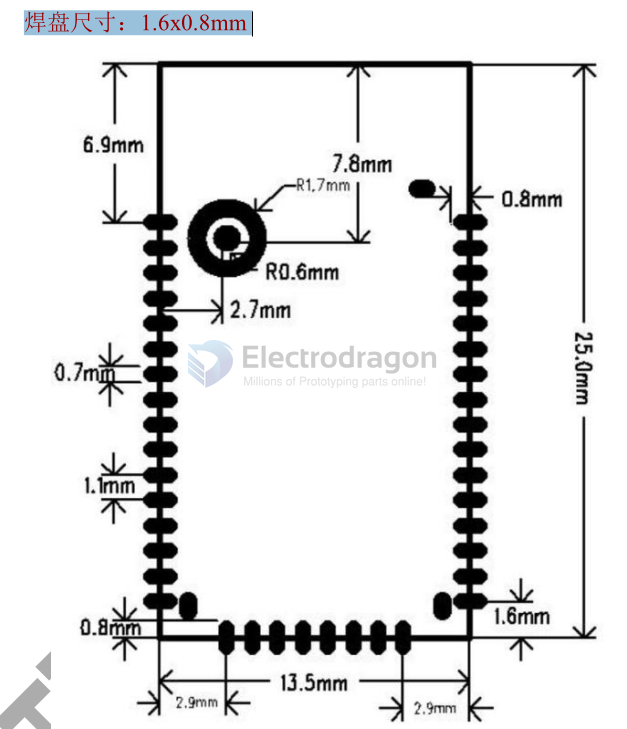
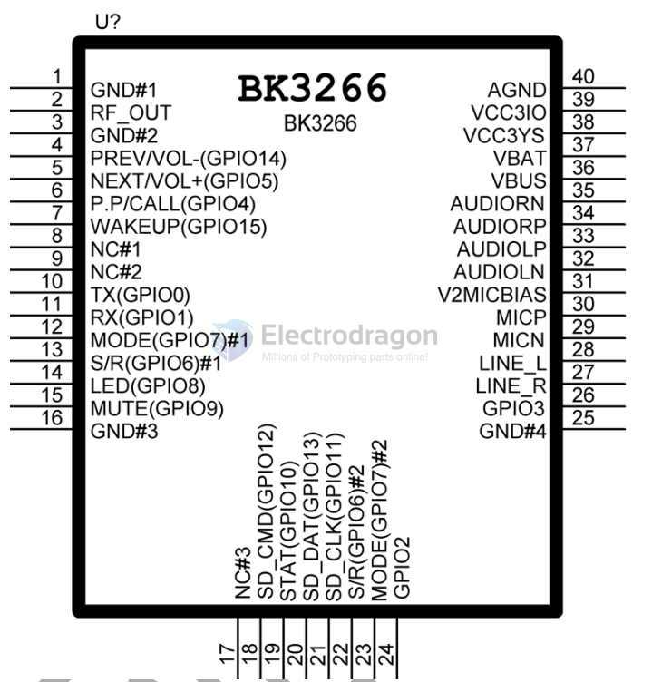
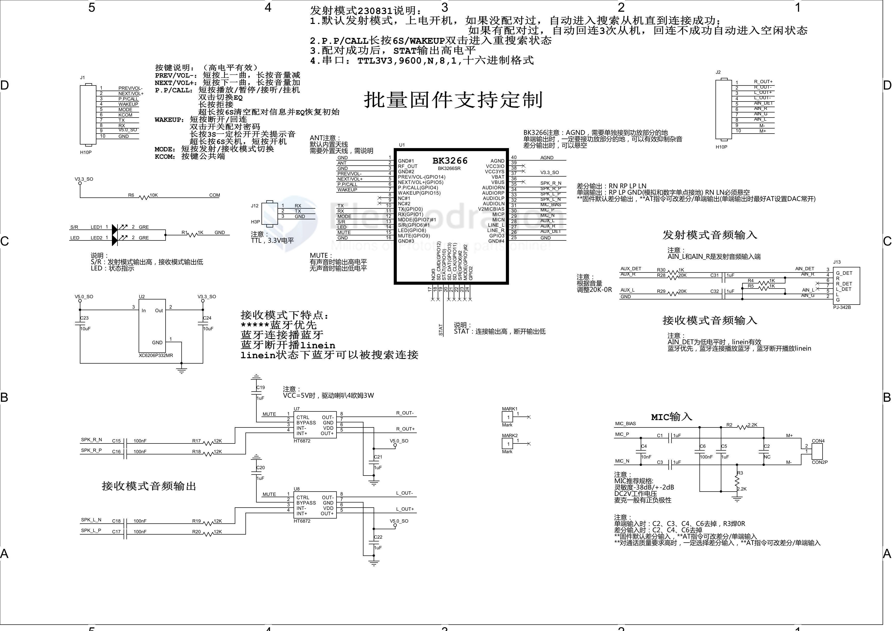
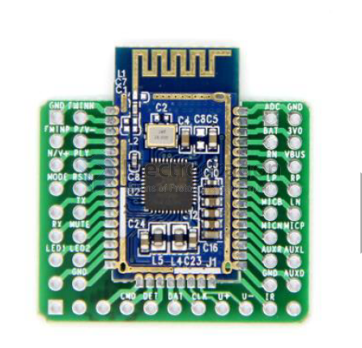

# NBL1111-dat

## Main control BK3266 Bluetooth version V5.2 stereo audio data transmission module, batch customization

1. Call function (AT can be turned off)
2. Serial port AT command control
3. Serial port AT modifies Bluetooth name and pairing password (password dynamic switch, AT/double-click MODE key to switch password)
4. Prompt tone (prompt tone dynamic switch, AT/long press MODE key for 3S to release the switch prompt tone)
5. Support SPP and BLE data transmission (BLE is closed by default, AT can be turned on, support background)
6. Support TF card playback (support selected serial number playback)
7. Support U disk playback function
8. Built-in antenna (optional external antenna version)
9. Support infrared remote control
10. Support AUX input
11. Support TF/U disk song name (short file name)
12. Audio differential/single-ended output classification optional (AT command can be set)
13. Select EQ (AT/double-click PLAY key to cycle through 9 EQ)

All controls support serial port AT commands, such as: MP3 song serial number query, etc., with very powerful functions.

The main control of this module uses Beken's BK3266 chip to provide high-quality sound quality and compatibility for the module, and the overall performance is superior. The Bluetooth module adopts a driver-free method. Customers only need to connect the module to the application product to quickly realize the wireless transmission of music and enjoy the fun of wireless music. It also supports key and AT serial port command control. Supports intelligent neutral voice prompts and supports "MODE" key power on and off. It can store 6 paired devices, and the module automatically reconnects to the last paired device after powering on. If 6 paired devices are turned on at the same time, the last paired device will be automatically connected.

- Support AT to modify the Bluetooth name, within 31 characters, see AT command description.
- Support AT to modify the Bluetooth pairing password, within 15 characters, see AT command description.

## application 

This module is mainly used for short-distance music transmission. It can be easily connected to Bluetooth devices of digital products such as laptops, mobile phones, PDAs, etc. to achieve wireless music transmission.

- 1) Stereo Bluetooth speakers;
- 2) Stereo Bluetooth headphones;
- 3) Stereo transmitter;
- 4) Bluetooth calls;
- 5) Bluetooth control and multimedia devices.

## Features 

### Key Features 

- 1)  Bluetooth v5.2 + EDR；
- 2)  A2DP v1.2；
- 3)  AVRCP v1.5；
- 4)  HFP v1.7；
- 5)  AVDTP v1.2；
- 6)  AVCTP v1.4；

### All Features 

- Model BK3266SR
- Bluetooth specification Bluetooth V5.2
- Power supply voltage DC3.3-4.2V
- Support Bluetooth protocols HFPV1.7, A2DPV1.2, AVRCPV1.5, AVCTPV1.2, AVDTPV1.2
- Working current ≤20mA
- Standby current <500uA
- Temperature range -40ºC ~ +80ºC
- Wireless transmission range ＞10 meters
- Transmission power Class2, 4dbm
- Sensitivity -81dBm<0.1%BER
- Frequency range 2.402GHz~2.480GHz
- External interface Serial port (TTL level), level conversion is required to connect to PC, such as CH340G, USB to TTL
- Audio performance SBC decoding
- Audio signal-to-noise ratio ≥75dB
- Module size 25x13.5x2mm
- Adapter board size 24x29mm

## Soldering Pad Dimesnion 

- 1.6 x 0.8 mm

## Pins Definitions 

| IO No. | IO Name           | IO Description                                                                                                                                                                                                                                                                                                   |
| ------ | ----------------- | ---------------------------------------------------------------------------------------------------------------------------------------------------------------------------------------------------------------------------------------------------------------------------------------------------------------- |
| 1      | GND               | Power Ground                                                                                                                                                                                                                                                                                                     |
| 2      | RF                | Not used                                                                                                                                                                                                                                                                                                         |
| 3      | GND               | Power Ground                                                                                                                                                                                                                                                                                                     |
| 4      | PREV/VOL-(GPIO14) | Single click to play the previous song/Long press to reduce the volume                                                                                                                                                                                                                                           |
| 5      | NEXT/VOL+(GPIO5)  | Single click to play the next song/Long press to increase the volume                                                                                                                                                                                                                                             |
| 6      | P.P/CALL(GPIO4)   | Short press to play/pause/answer the call/Double click to switch EQ/Long press for 8S to clear the pairing list and restore the initial EQ                                                                                                                                                                       |
| 7      | WAKEUP(GPIO15)    | Long press for 6S to shut down, short press to turn on/Default power on/In receiving mode: short press to disconnect and reconnect, double click to switch password, long press for 3S to release the switch prompt tone/In transmitting mode: short press to disconnect/reconnect, double click to search again |
| 8      | NC                | Empty pin                                                                                                                                                                                                                                                                                                        |
| 9      | NC                | Empty pin                                                                                                                                                                                                                                                                                                        |
| 10     | TX(GPIO0)         | Serial port TX (TTL level 3.3V)                                                                                                                                                                                                                                                                                  |
| 11     | RX(GPIO1)         | Serial port RX (TTL level 3.3V)                                                                                                                                                                                                                                                                                  |
| 12     | MODE(GPIO7)       | Short press to switch between transmit and receive modes                                                                                                                                                                                                                                                         |
| 13     | S/R(GPIO6)        | Transmit mode output high / receive mode output low                                                                                                                                                                                                                                                              |
| 14     | LED(GPIO8)        | Status indicator                                                                                                                                                                                                                                                                                                 |
| 15     | MUTE(GPIO9)       | Control amplifier enable pin, high output 3.3V with sound, low output 0V without sound                                                                                                                                                                                                                           |
| 16     | GND               | Power ground                                                                                                                                                                                                                                                                                                     |
| 17     | NC                | Empty pin                                                                                                                                                                                                                                                                                                        |
| 18     | SD_CMD(GPIO12)    | Not used                                                                                                                                                                                                                                                                                                         |
| 19     | STAT(GPIO10)      | Bluetooth connection successful output high level / Bluetooth disconnection output low level                                                                                                                                                                                                                     |
| 20     | SD_SDO(GPIO13)    | Not used                                                                                                                                                                                                                                                                                                         |
| 21     | SD_CLK(GPIO11)    | Not used                                                                                                                                                                                                                                                                                                         |
| 22     | S/R(GPIO6)        | Equivalent to IO number 13                                                                                                                                                                                                                                                                                       |
| 23     | MODE(GPIO7)       | is equivalent to IO number 12                                                                                                                                                                                                                                                                                    |
| 24     | GPIO2             | is not used                                                                                                                                                                                                                                                                                                      |
| 25     | GND               | is the power ground                                                                                                                                                                                                                                                                                              |
| 26     | GPIO3             | is the AUX input detection pin in the receiving mode, and the low level is valid                                                                                                                                                                                                                                 |
| 27     | AUX_R             | is the right channel input of the transmitting function                                                                                                                                                                                                                                                          |
| 28     | AUX_L             | is the left channel input of the transmitting function                                                                                                                                                                                                                                                           |
| 29     | MICN              | is the negative terminal of the MIC input                                                                                                                                                                                                                                                                        |
| 30     | MICP              | is the positive terminal of the MIC input                                                                                                                                                                                                                                                                        |
| 31     | VMIC              | is the MIC bias voltage                                                                                                                                                                                                                                                                                          |
| 32     | AUDIOLN           | is the negative terminal of the audio left channel differential output                                                                                                                                                                                                                                           |
| 33     | AUDIOLP           | is the positive terminal of the audio left channel differential output                                                                                                                                                                                                                                           |
| 34     | AUDIORP           | is the positive terminal of the audio right channel differential output                                                                                                                                                                                                                                          |
| 35     | AUDIORN           | is the negative terminal of the audio right channel differential output                                                                                                                                                                                                                                          |
| 36     | VBUS              | is not used                                                                                                                                                                                                                                                                                                      |
| 37     | VBAT              | is the power input (3.3V~4.2V)                                                                                                                                                                                                                                                                                   |
| 38     | VCC3YS            | is the 3V output                                                                                                                                                                                                                                                                                                 |
| 39     | VDD3IO            | 3V output (no voltage output after the "MODE" key is turned off)                                                                                                                                                                                                                                                 |
| 40     | AGND              | When single-ended audio output, it must be connected to the ground of the power amplifier to remove noise. When differential audio output, it can be left floating                                                                                                                                               |

## Serial 

### Serial port configuration
1. Baud rate 9600;
2. 8 data bits;
3. No parity bit;
4. One stop bit;
5. Hexadecimal format.

### Command format

- Control command format: COM+<CMD>[<param>]
- Data feedback format: <IND>[<param>]\n
- Description: The control command is the control command from the host to the Bluetooth. It starts with "COM+" and is followed by the <CMD> control command. If the command has parameters, the <param> parameter will be transmitted immediately after the command.
- Data feedback is the feedback of various status and data information from Bluetooth to the host. <IND> is the feedback command. If parameters are required, the <param> parameter will be transmitted immediately after <IND>.

### Commands List 

| command      | command note                                                                                                                                           | note                                 | example                                                                                                                      |
| ------------ | ------------------------------------------------------------------------------------------------------------------------------------------------------ | ------------------------------------ | ---------------------------------------------------------------------------------------------------------------------------- |
| +SNAME+      | Example: RECV+SNAME+BTBLUE BTBLUE is the modified name                                                                                              | Change Bluetooth name                | RECV+SNAME+XXXX XXXX: up to 31 characters Correct: OK\n Error: ERR\n Effective after power off and restart    |
| GNM          |                                                                                                                                                        | query Bluetooth name                 | RECV+GNM Return: NA_HY5066SR\n                                                                                            |
| +SPIN+       | Example: RECV+SPIN+1234 1234 is the modified password                                                                                            | Change Bluetooth Pairing password | RECV+SPIN+XXXX XXXX: up to 15 characters Correct: OK\n Error: ERR\n Effective immediately                        |
| GPI          |                                                                                                                                                        | query pairing password               | RECV+GPI Return: PN_1234\n                                                                                                |
| GAD          |                                                                                                                                                        | query Bluetooth address              | RECV+GAD Return: AD_191919191919\n                                                                                        |
| MEQ          |                                                                                                                                                        | query EQ                             | RECV+MEQ Return: NORMAL\n BOOST\n TREBLE\n POP\n ROCK\n CLASSIC\n JAZZ\n DANCE\n R&P\n         |
| SETEQxx      | xx：NORMAL BOOST TREBLE POP ROCK CLASSIC JAZZ DANCE R&P Support power-off saving Default “NORMAL”                        | EQ setting                           | RECV+SETEQNORMAL Correct: corresponding EQ\n Error: ERR\n Immediately effective                                     |
| CALLxx       | xx：ON” to turn on the call function xx：OFF” to turn off the call function Support power-off saving Default to turn on the call function  | Call function setting                | RECV+CALLON Turn on the call function RECV+CALLOFF Turn off the call function Immediately restart to take effect |
| MCALL        |                                                                                                                                                        | query call settings                  | RECV+MCALL Turn on: CALLON\n Turn off: CALLOFF\n                                                                       |
| MPINST       |                                                                                                                                                        | query password status                | RECV+MPINST                                                                                                                  |
| PINON        | REBOOT to take effect after restart                                                                                                                    | Pairing password turned on           | RECV+PINON                                                                                                                   |
| PINOFF       | REBOOT to take effect after restart                                                                                                                    | Pairing password off                 | RECV+PINOFF                                                                                                                  |
| MDACST       |                                                                                                                                                        | Query DAC status                     | RECV+MDACST                                                                                                                  |
| DACDIFFER    | REBOOT Reboot to take effect                                                                                                                           | DAC differential output              | RECV+DACDIFFER                                                                                                               |
| DACSINGLE    | REBOOT Reboot to take effect                                                                                                                           | DAC single-ended output              | RECV+DACSINGLE                                                                                                               |
| MCHANST      |                                                                                                                                                        | Query channel status                 | RECV+MCHANST                                                                                                                 |
| STEREO       | REBOOT Reboot to take effect Stereo output                                                                                                             | RECV+STERRO                          |
| MONO         | REBOOT Reboot to take effect Mono output                                                                                                               | RECV+MONO                            |
| MMICST       |                                                                                                                                                        | Query MIC status                     | RECV+MMICST                                                                                                                  |
| MICDIFFER    | REBOOT Reboot to take effect MIC differential input                                                                                                    | RECV+MICDIFFER                       |
| MICSINGLE    | REBOOT Reboot to take effect MIC single-ended input                                                                                                    | RECV+MICSINGLE                       |
| MDACALWAYS   |                                                                                                                                                        | Query DAC Normal open status         | RECV+MDACALWAYS                                                                                                              |
| DACALWAYSON  | REBOOT Restart takes effect                                                                                                                            | DAC is always on                     | RECV+DACALWAYSON                                                                                                             |
| DACALWAYSOFF | REBOOT Restart takes effect                                                                                                                            | DAC is not always on                 | RECV+DACALWAYSOFF                                                                                                            |

#### The following are COM common instructions

| command  | command note                                                                                                                              | note                                           | example                                                                                                                   |
| -------- | ----------------------------------------------------------------------------------------------------------------------------------------- | ---------------------------------------------- | ------------------------------------------------------------------------------------------------------------------------- |
| MMODE    |                                                                                                                                           | query mode                                     | COM+MMODE                                                                                                                 |
| SENDMODE |                                                                                                                                           | transmission mode                              | COM+SENDMODE                                                                                                              |
| RECVMODE |                                                                                                                                           | Receiving mode                                 | COM+RECVMODE                                                                                                              |
| SETTSxx  | xx: (00-16) Support power-off saving                                                                                                   | Set the prompt sound volume                    | COM+SETTSxx Correct: OK\n Error: ERR\n                                                                              |
| MTS      | x: (00-16)                                                                                                                                | Query the current prompt sound volume          | COM+MTS Correct: TSx\n Error: ERR\n                                                                                 |
| Vxx      | xx: (00-16) Support power-off saving                                                                                                   | Set the default startup sound volume           | COM+Vxx Correct: COM_Vxx\n Error: ERR\n                                                                             |
| GV       | xx: (00-16)                                                                                                                               | Query the default volume of the power-on sound | COM+GV Correct: COM_Vxx\n Error: ERR\n                                                                              |
| TONExx   | xx: "ON" turns on the prompt tone xx: "OFF" turns off the prompt tone Supports power-off saving Default turns on the prompt tone | Prompt tone setting                            | COM+TONEON Turn on the prompt tone COM+TONEOFF Turn off the prompt tone Effective immediately                 |
| MTONE    |                                                                                                                                           | Query prompt tone setting                      | COM+MTONE Turn on: TOMEON\n Turn off: TOMEOFF\n                                                                     |
| GOBACKxx | xx: "ON" turns on the backlink xx: "OFF" turns off the backlink Supports power-off saving Default turns on the power-on backlink | Power-on backlink setting                      | COM+GOBACKON Turn on the power-on backlink COM+GOBACKOFF Turn off the power-on backlink Effective immediately |
| MGOBACK  |                                                                                                                                           | Query backlink setting                         | COM+MGOBACK Open: GOBACKON\n Close: GOBACKOFF\n                                                                     |
| PR       |                                                                                                                                           | Enter pairing                                  | COM+PR                                                                                                                    |
| AC       |                                                                                                                                           | Reconnect to last pairing                      | COM+AC                                                                                                                    |
| DC       |                                                                                                                                           | Disconnect                                     | COM+DC                                                                                                                    |
| CA       |                                                                                                                                           | Answer call                                    | COM+CA                                                                                                                    |
| CJ       |                                                                                                                                           | Reject call                                    | COM+CJ                                                                                                                    |
| CE       |                                                                                                                                           | Hang up                                        | COM+CE                                                                                                                    |
| CR       |                                                                                                                                           | Last number redial                             | COM+CR                                                                                                                    |
| PP       |                                                                                                                                           | Play/pause music                               | COM+PP                                                                                                                    |
| PA       |                                                                                                                                           | Play music                                     | COM+PA                                                                                                                    |
| PU       |                                                                                                                                           | Pause music                                    | COM+PU                                                                                                                    |
| PN       |                                                                                                                                           | Next song                                      | COM+PN                                                                                                                    |
| PV       |                                                                                                                                           | Previous song                                  | COM+PV                                                                                                                    |
| VP       |                                                                                                                                           | Volume up                                      | COM+VP                                                                                                                    |
| VD       |                                                                                                                                           | Volume down                                    | COM+VD                                                                                                                    |
| REBOOT   | This restart is equivalent to power off restart                                                                                           | Restart                                        | COM+REBOOT                                                                                                                |
| GREMOTE  |                                                                                                                                           | Query remote information                       | COM+GREMOTE                                                                                                               |
| BR9600   |                                                                                                                                           | Settings 9600                                  | COM+BR9600                                                                                                                |
| BR115200 |                                                                                                                                           | Settings 115200                                | COM+BR115200                                                                                                              |
| CLEAR    |                                                                                                                                           | Clear pairing information                      | COM+CLEAR                                                                                                                 |

#### The following is the SEND transmission command

| command | command note                                                | note                                  | example         |
| ------- | ----------------------------------------------------------- | ------------------------------------- | --------------- |
|         |                                                             | Query transmission Connection mode | SEND+MSTARTM    |
|         | Default: automatic mode                                     | Automatic mode                        | SEND+STARTM0    |
|         | Use command search control Manual mode must be turned on | Manual mode                           | SEND+STARTM1    |
|         | Reserved, do not set                                        | Customized by customer                | SEND+STARTM2    |
|         | The search will automatically output the results            | Search slave                          | SEND+INQUIRY    |
|         |                                                             | Query search results                  | SEND+RESULT     |
|         | Select connection according to search results               | Select serial number connection       | SEND+SELx       |
|         | For example: SEND+CONNM+S10                                 | Specify name connection               | SEND+CONNM+xxxx |

## SCH

## preload SSCOM commands 

- [[NBL1111-AT.ini]] put this ini file into SSCOM exe folder - [[SSCOM-dat]]

## breakout module 

## ref 

- [[bt-audio-dat]]