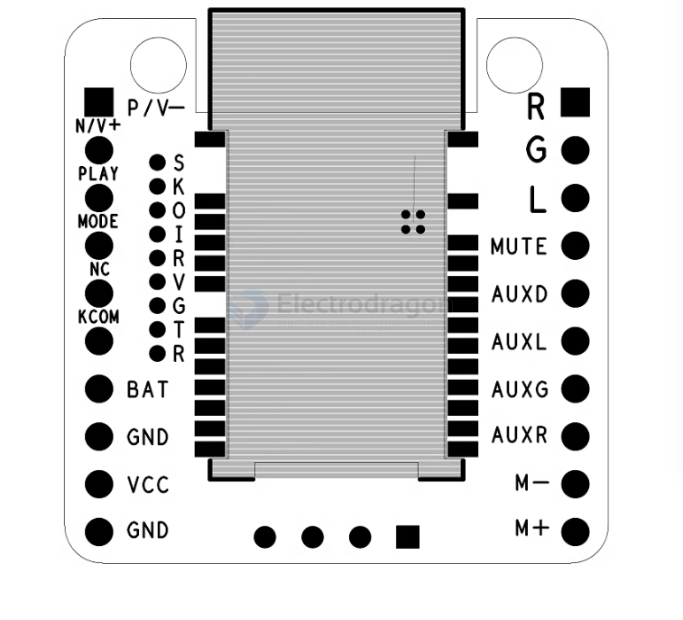
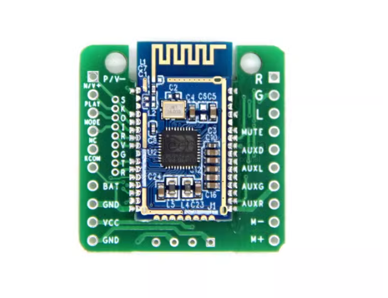

# NBL1115-dat

- Core board [[NBL1111-dat]] with [[PAM-dat]] amplifier [[PAM8908-dat]]
- board dimension 2.9x2.9 CM

https://www.electrodragon.com/product/bluetooth-audio-breakout-board-w-amp-car-receiver-bluetooth-5-0-bk3266/

## Pin Map 

- GND, BAT: 3.7V or 4.2V lithium battery power supply
- GND, VCC: 5V or 12V power supply, selected according to DC isolation
- OUTL, AGND, OUTR: single-ended output, can be directly connected to headphones, amplifiers, audio and other input devices.
- COM: the common end of the button, the other end of the button is connected to P/V+, N/V-, PLAY, MODE (the corresponding function of the silk screen is according to the actual diagram)
- AUXD, AUXL, AUXG, AUXR: audio input,
- AUXD: audio input detection pin, input low level to switch to audio input mode

## Power Supply 

1. No DC isolated power supply: suitable for lithium battery power supply, making Bluetooth headsets
2. With DC isolated power supply: suitable for modifying speakers, amplifiers, and adding Bluetooth functions to cars to solve common ground current sound and noise

## Wiring 

- Please see on this page [[audio-output-dat]]

## ref 

- [[NBL1115]]

- [[audio-dat]] - [[bt-audio-dat]]