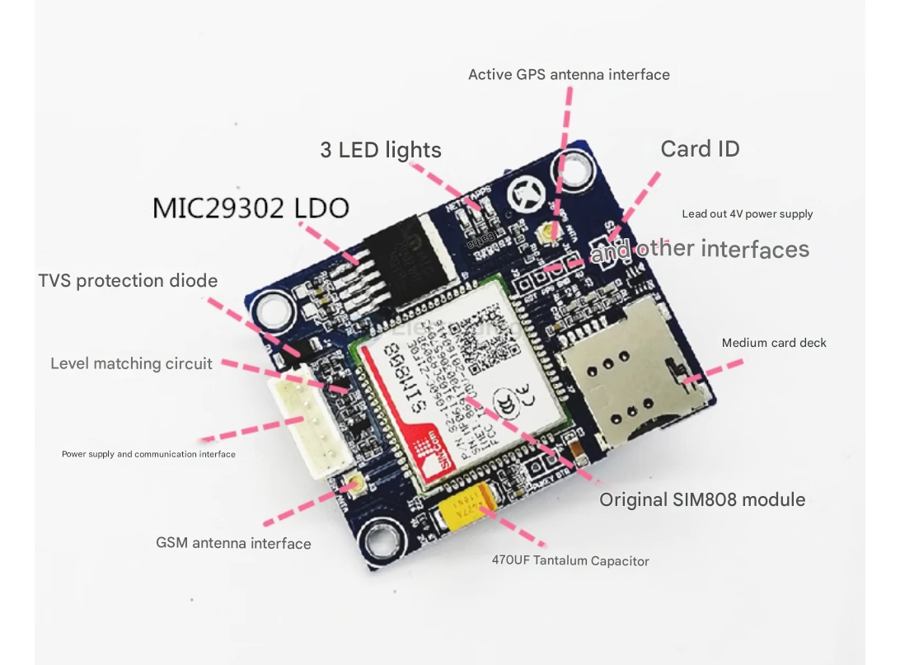

# NGS1024-dat

[SIM808 Dev. Board (GSM+GPRS+GPS, Replacing SIM908)](https://www.electrodragon.com/product/sim808-dev-board-gsmgprsgps-replacing-sim908/)

## modules 

[[SIM808-dat]] - https://www.electrodragon.com/product/sim808-dev-board-gsmgprsgps-replacing-sim908/

[[SIM800-dat]] - https://www.electrodragon.com/product/sim800c-dev-breakout-board-antenna/

## Board Images 

## Features: 

1.  **GSM Antenna Interface:** First-generation IPX antenna interface. Convenient for connecting various antennas.
2.  **Power Supply and Communication Interface:** Supports 5-12V power supply. The communication interface is a TTL level interface with level matching circuitry, allowing direct connection to controllers like 51/STM32.
3.  **LDO:** Uses the MIC29302 chip, providing 2A current, supporting 5-20V voltage input (recommended 5-12V, higher voltage will cause heat). Very convenient to use.
4.  **LED Indicators:** Network, Status, and PPS lights, indicating network registration status and GPS positioning status.
5.  **Active GPS Antenna Interface:** Supply voltage is around 3.8V, uses a first-generation IPX antenna interface, good expandability, active antenna provides good positioning effect.
6.  **SIM Card Slot:** Medium card holder, the notch should face outwards when inserting the card.
7.  **Breakout Interfaces:** Breaks out the 3.7V lithium battery power interface and reset interface. Can be connected to a 3.7V lithium battery for power. The reset interface can be used to reset the module if it malfunctions.
8.  **Additionally:** The back of the board breaks out the audio interface, USB interface, and Bluetooth antenna interface.

## Note 

- 2G service are slowly shut down in more and more countries, you should consider you [[SIM7020-dat]] - [[NGS1094-dat]] - [[NGS1095-dat]] - [[NGS1096-dat]] instead

## ref 

- [[M2M-dat]] - [[SIM808-dat]] - [[SIM800-dat]] - [[SIMCOM-dat]]

- [[antenna-dat]]

- [[NGS1024]]