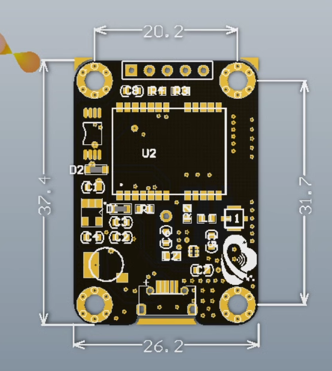

# NGS1052-dat

https://www.electrodragon.com/product/neo-6m-gps-module-r2/

- [legacy wiki page](https://w.electrodragon.com/w/Ublox_GPS)

## Board Map 

| Pin | Definitions | Descrpitions                                                                                    |
| --- | ----------- | ----------------------------------------------------------------------------------------------- |
| 1   | VCC         | power pin input 3.3-5.5V                                                                        |
| 2   | GND         | power ground                                                                                    |
| 3   | RXD         | module serial port receiving pin--connected to the microcontroller serial port TXD transmission |
| 4   | TXD         | module serial port sending pin--connected to the microcontroller serial port RXD receiving      |
| 5   | PPS         | clock pulse output pin                                                                          |

## ref 

- [[GPS-dat]] - [[NEO-6-dat]] - [[u-blox-dat]]

- [[NGS1052]]