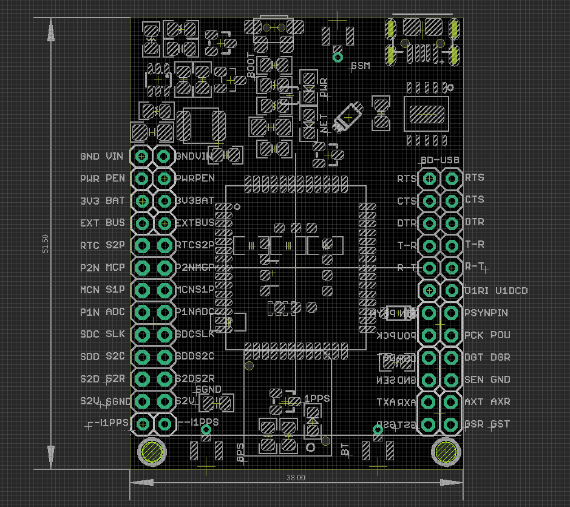
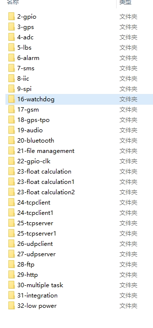

# NGS1063 DAT

[ed20-tracker-board-gsm-gprs-gnss-iot](https://www.electrodragon.com/product/ed20-tracker-board-gsm-gprs-gnss-iot/)

legacy wiki info 

- https://w.electrodragon.com/w/Category:ED20
- https://www.electrodragon.com/w/MT2503_Intro
- https://w.electrodragon.com/w/ED20_HDK
- https://w.electrodragon.com/w/ED20_SDK

## Board map V5 

Setup by jumpers 

| Board UART1 | AUX UART2 | CH340 | GPS UART |
| ----------- | --------- | ----- | -------- |
| TXD         | -         | RXD   | -        |
| RXD         | -         | TXD   | -        |
| -           | TXD       | -     | RXD      |
| -           | RXD       | -     | RXD      |

Board LEDS 

- netlight status LED
- Power LED
- 1PPS LED 

Booting by Button, baudrate 115200 or 9600, it is dynamic

Boot output without custom firmware, and SIM installed 

    SMS Ready

Test commands 

    AT
    OK

for old version see here - [[NGS1063-old-dat]]

## Firmware Code 

- default [[quectel-at-dat]] firmware also in the [github](https://github.com/Edragon/Quectel_ED20.git), you can flash it back to use AT commands 

- custom firmware please see below, [get in github here](https://github.com/Edragon/Quectel_ED20.git)

- instructions at [[NGS1063-SDK-dat]]

- and Custom SDK List 

## demo video 

- [for the default firmware TG](https://t.me/electrodragon3/340)

## Customization 

- Board hardware customize, please contact us if you have any need.
- Support custom module label for buck order 20pcs

## ref 

- [[ED20-dat]]

- [[quectel-dat]] - [[quectel-at-dat]]

- [[MT2503-dat]] - [[mediatek-dat]]

- [[serial-dat]] - [[CH340-dat]] - [[dcdc-buck-dat]] - [[power-dat]] - [[SIM-dat]]

- [[quectel-GNSS-AT-dat]] 

- [[NGS1063-SDK-DAT]]

- [[NGS1063]] - [[NGS1063-fab]]

- [[network-dat]] - [[location-dat]]

- [[NGS1063-old-dat]]