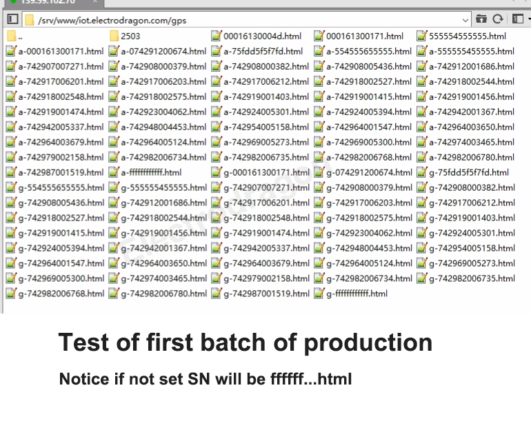

# NGS1063 DAT

https://www.electrodragon.com/product/ed20-tracker-board-gsm-gprs-gnss-iot/

legacy wiki info 

- https://w.electrodragon.com/w/Category:ED20
- https://www.electrodragon.com/w/MT2503_Intro
- https://w.electrodragon.com/w/ED20_HDK
- https://w.electrodragon.com/w/ED20_SDK

## Board map V5 

for old version see here - [[NGS1063-old-dat]]

Setup by jumpers 

| Board UART1 | AUX UART2 | CH340 | GPS UART |
| ----------- | --------- | ----- | -------- |
| TXD         | -         | RXD   | -        |
| RXD         | -         | TXD   | -        |
| -           | TXD       | -     | RXD      |
| -           | RXD       | -     | RXD      |

Board LEDS 

- netlight status LED
- Power LED
- 1PPS LED 

Booting by Button, baudrate 115200, 

Boot output without custom firmware, and SIM installed 

    SMS Ready

Test commands 

    AT
    OK

## Customization 

- Board hardware customize, please contact us if you have any need.
- Support custom module label for buck order 20pcs

## SDK List 

## Tracking records 

- support [[LBS-dat]] and [[GPS-dat]]

## ref 

- [[ED20-dat]] - [[quectel-dat]] - [[MT2503-dat]] - [[mediatek-dat]]

- [[serial-dat]] - [[CH340-dat]] - [[dcdc-buck-dat]] - [[power-dat]] - [[SIM-dat]]

- [[quectel-GNSS-AT-dat]]

- [[NGS1063-SDK-DAT]]DK-DAT]]

- [[NGS1063]] 