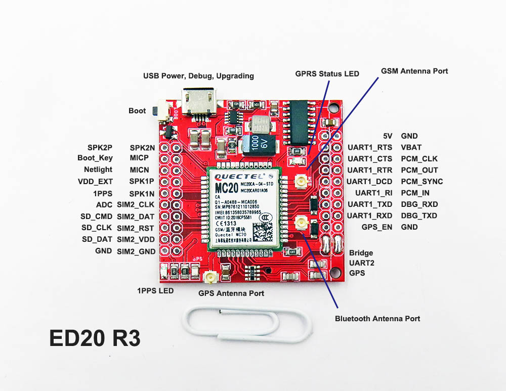
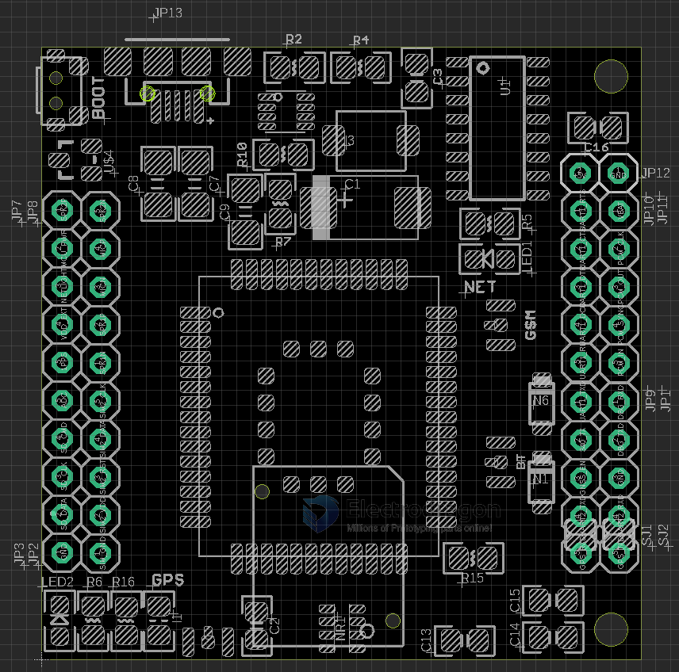

# NGS1063 DAT

legacy wiki info 

- https://w.electrodragon.com/w/Category:ED20
- https://www.electrodragon.com/w/MT2503_Intro
- https://w.electrodragon.com/w/ED20_HDK
- https://w.electrodragon.com/w/ED20_SDK

## board layout (R4)

## Customization 

- Board hardware customize, please contact us if you have any need.
- Support custom module label for buck order 20pcs

## ref 

- [[ED20]]
- [[quectel-GNSS-AT]]

- [[NGS1063-HDK-V1-DAT]]