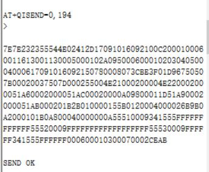

# NGS1063-SDK-DAT

## server side 

- https://github.com/Edragon/ED20-webserver
- version version see here: [[server-main-v2.py]]

- The server receive the [[TCP-dat]] data at port 8100

## Client Side 

- [[NGS1063-dat]] side 

### demo data 

## The data flow like below: 

    [2017-09-10 18:47:00.551] [INFO] stream - RECV <- 
    
    [2017-09-10 18:47:00.553] [INFO] stream - 7E7E232355544E02375617091018465800B6000100060011613000FF0005000102A095000600010203040500040006170910184658514000080739F35801DBC6764E21000200004E220002000051A60002000051AC00020000A09800011351A90002000051AB0002016BB010000115B012000400018229B0A2000101B0A800040000000A55510009FFFFFFFFFFFFFFFFFF55520009FFFFFFFFFFFFFFFFFF55530009000000FFFFFFFFFFFF000600010300070002F144
    
    [2017-09-10 18:47:00.572] [INFO] server - 0011613000FF time:2017-09-10 18:46:58 Send Position(121.23836,31.180406)
    
    [2017-09-10 18:47:00.781] [INFO] stream - SEND ->
    
    [2017-09-10 18:47:00.784] [INFO] stream - 7E7E232355544E153756170910184658002C000100060011613000FF00050001020006000104000700029E3

#### the main data packet

    7E7E232355544E02375617091018465800B6000100060011613000FF0005000102A095000600010203040500040006170910184658514000080739F35801DBC6764E21000200004E220002000051A60002000051AC00020000A09800011351A90002000051AB0002016BB010000115B012000400018229B0A2000101B0A800040000000A55510009FFFFFFFFFFFFFFFFFF55520009FFFFFFFFFFFFFFFFFF55530009000000FFFFFFFFFFFF000600010300070002F144

And here is the explaination of the data packet, funtion start at void Head_Init(u16 func)

    7E7E         // -- 0~4 

    2323 5554      // version 4~12

    4E02         // Action 12~16

    0011         // packet times 16~20

    1709 0816 5446 // time 20~32

    00B6         // data length 32~36 

    0001 0006    // tlv data type + length ProIdInit 36~44

    0011 6130 00FF // tlv data 44~56

    0005 0001    // tlv data type + length ProSigInit 56~64

    02           // tlv Value ProValuesInit 64~66

    A095 0006    // tlv data type + length ProValuesInit 66~74

    0001 0203 0405 // tlv value Pro.subsn -- not used 74~86

    0004 0006    // tlv       Pro.time 86~94

    1709 0816 5446 // time 94~106

    5140 0008    // LBS location flag, GPS is 0x5078 0x0008 106~114

    073B A380     // my_core_data.latitude 114~122

    01DC 6522     // my_core_data.longitude

    4E21 0002    // tlv

    0000         // pro.tem

    4E22 0002    // tlv

    0000         // pro.hum

    51A6 0002 

    0000         // Pro.ChargIn

    51AC 0002 

    0000         // Pro.ChargOut

    A098 0001

    12           // Signal strength

    51A9 0002

    0000         // Pro.bvol

    51AB 0002

    01A0         // Pro.hvol  

    B010 0001    // CenterIDTlV
