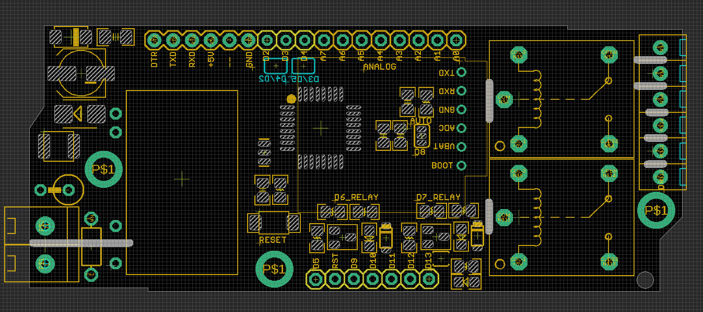

# NGS1072 DAT

- D2/D3 or D4/D5 Serial to SIM808
- D6/D7 - Relay
- D8 - SIM800 BOOT
- D13 - PROG LED

- FTDI FT232RL cable match programming pins on top-left: 
  - DTR TXD RXD +5V -- GND

## Accompany Module 

- [[NGS1071-dat]]

## hardware Setup
- arduino pro mini 5V/16M
- SIM800 software serial port, selected by SMD jumper: D2 + D3 or D4 + D5 
- pull D8 pin to HIGH for at lease 2 seconds, and then LOW to boot SIM800 module 
    - SIM800 Network LED should start to link

## Demo video 

- https://www.youtube.com/watch?v=U4_cRzhXZws

## Demo Code 

- https://github.com/Edragon/Arduino-main/tree/master/Sketchbook/RF/NGS1072
- https://github.com/Edragon/Arduino/tree/master/Sketchbook/01_GSM/
- Please use as a refernece, the repository may need sort out.

## Programming

- You will need CP2102 or FT232RL, etc, connect 5V, GND, TX, RX, RST to board relevant pin 5V, GND, RX, TX and DTR.
- A standard FTDI connector wiring image could see here. 
- Board pre flashed with **arduino pro mini 5V/16M firmware**, please choose this as board, and free to upload new code.

## Note 

- Notice: current board can not fit into our relay board case, AC-DC unit is too big, will make next version supported.

## ref 

- [[SIMCOM-dat]] - [[ACDC-dat]]

- [[NGS1072]]

- [[atmega328-dat]]