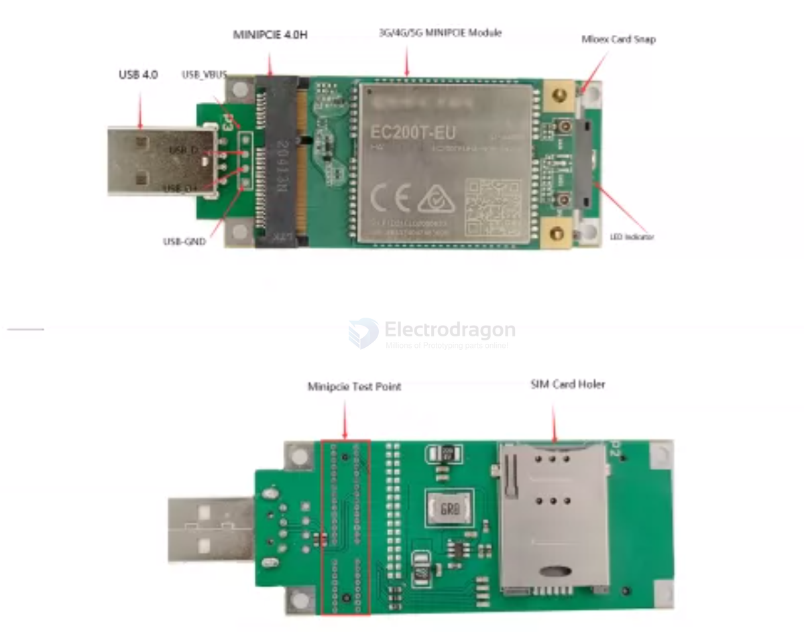
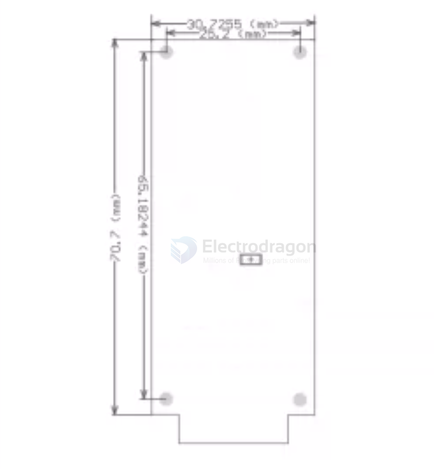
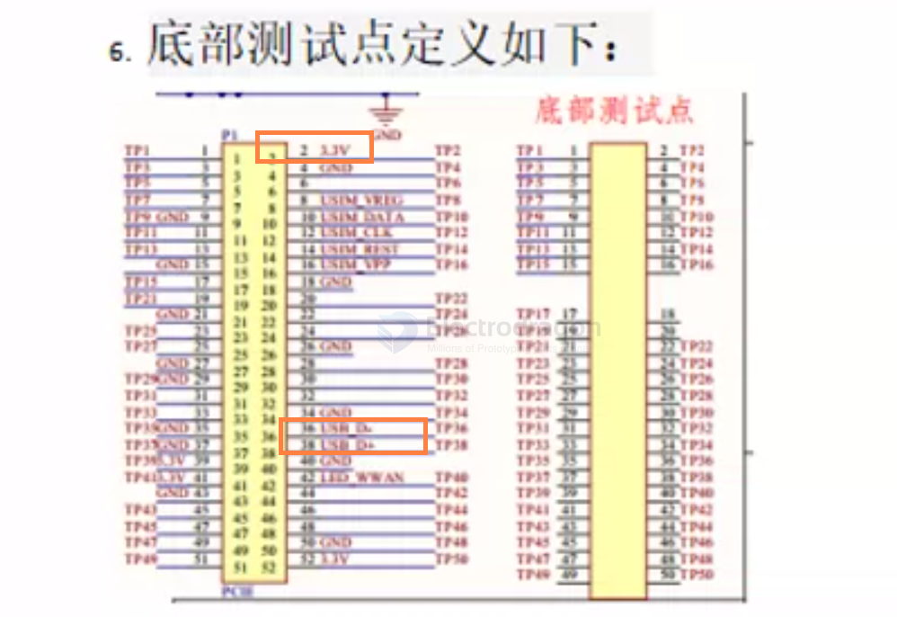

# NGS1075-dat

[MINI PCI-E PCIE to USB Converter MotherBoard](https://www.electrodragon.com/product/minipci-e-usb-converter-3g-wwan-wifi-module-w-sim-slot/)

- [[PCIE-dat]] - [[conn-pcie-dat]] - [[CONN-USB-dat]] - [[USB-SDK-dat]] - [[NGS1075-dat]]

board with the carried module 

dimension 

pins 

## A support list of most modules:

Huawei: - [[huawei-dat]]

MU609 PCIE MU709S-2 PCIE MU709S-6 PCIE MU509-B PCIE MC509-A EM770 770J 770W EM820U 820W MU909-521 MU909s-821 MU909S-120 And so on.

ZTE:

MF210 MF210V1 MF210V2 AD3812 MC2716 ME3620 ME3630 ME3760 ME3610 and so on.

Long Shang:

U8300 U8300W U8300C C5300V U7500E and so on

Domain:

CLM920 full range of PCIE modules, CLM920-CN CLM920-CN3 CLM920-EC5

Move away:

UC20 full range of PCIE, EC20 full range of PCIE module

SIMCOM:

sim7100, sim7600 full range of PCIE module

Support sierra wireless, Telit, cinterion, Ericsson, SAMSUNG, China domain, Datang brands such as 3G 4G card, for the Internet through the USB port and the module Brush, debugging, testing and unlocking.

## ref 

- [[conn-pcie-dat]]

- [[NGS1075]]