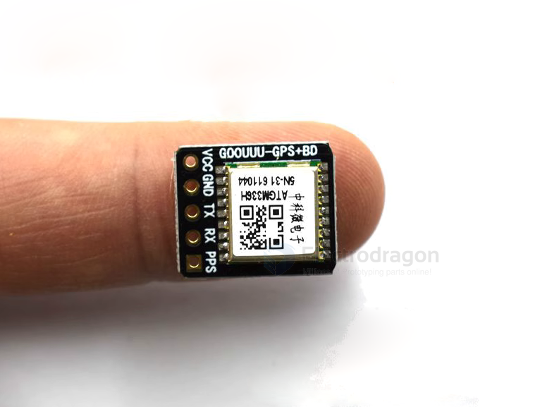
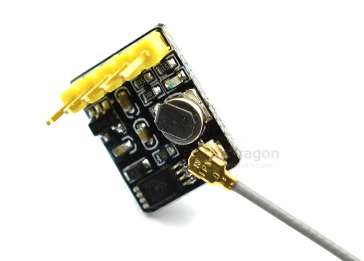
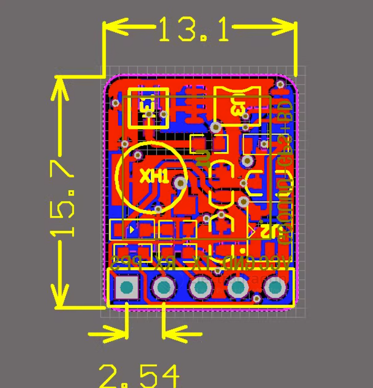

# NGS1078-dat

- [GNSS Module, GPS Beidou, ATGM336H-5N](https://www.electrodragon.com/product/gnss-module-atgm336h/)

## Appearance and Dimension 

- UART as primary output channel
- Output according to the protocol format of NMEA0183

## Dimension 

## ref 

- [[ATGM336H-dat]] - [[NEO-6M-dat]] - [[NEO-M8N-dat]] - [[NEO-6N-dat]]

- [[GPS-dat]]
  
- [[NGS1078]]