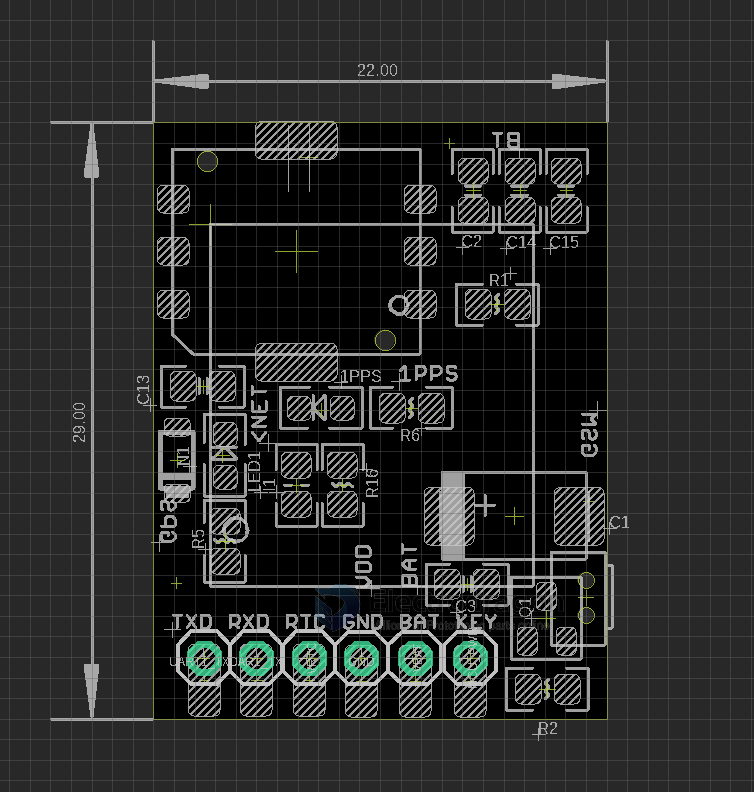
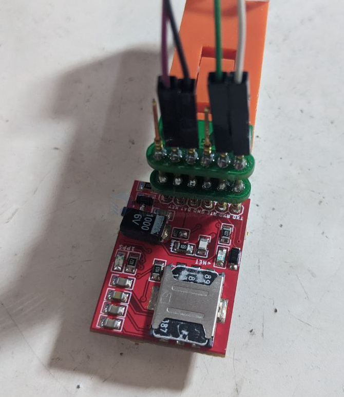

# NGS1089-dat

legacy wiki page 

- https://www.electrodragon.com/w/SIM868_Debug
- https://www.electrodragon.com/w/SIM868

## Pin Definitions 

- TXD
- RXD
- RTC
- GND
- BAT -> direct power supply 4.2V
- KEY

Antenna Ports 
- BT
- GSM
- GPS 

## Usage:
- Test can work directly with arduino, use guide please see wiki page.
- For long term use, for example arduino, simply add extra diode (shipment included) if use 5V power supply.
- Please look for our "[SIM868 Debug](https://www.electrodragon.com/w/SIM868_Debug)" wiki page if you encouter GNSS read problem.

## Quick Setup 

| Functions            | Setup and Pins             |
| -------------------- | -------------------------- |
| power supply         | direct 4.2V VBAT           |
| serial communication | TXD / RXD                  |
| logic shifter level  | None                       |
| serial baudrate      | 9600                       |
| network              | 2G/GPRS                    |
| location             | GPS                        |
| boot mode            | press-button / mcu-trigger |

## Note 
R1.1 version slightly optimize board layout, all antenna connectors on same side.

## Demo video 

- https://x.com/electro_phoenix/status/1002174191238443008
- https://x.com/electro_phoenix/status/1001089408806797312

## ref 

- chip info - http://simcomm2m.com/En/module/detail.aspx?id=145

- [[GPS-dat]] - [[SIMCOM-dat/SIMCOM-dat]]

- [[SIM800-dat]] - [[NGS1071-dat]] (not pin compatible)

- [[NGS1089]]