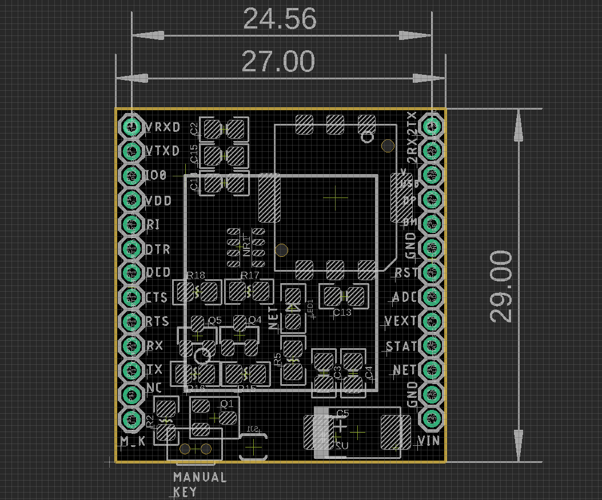
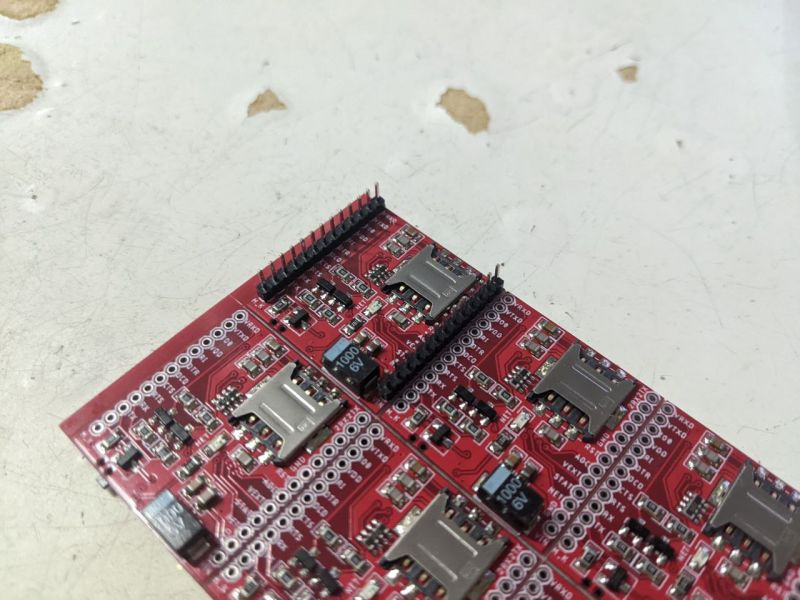
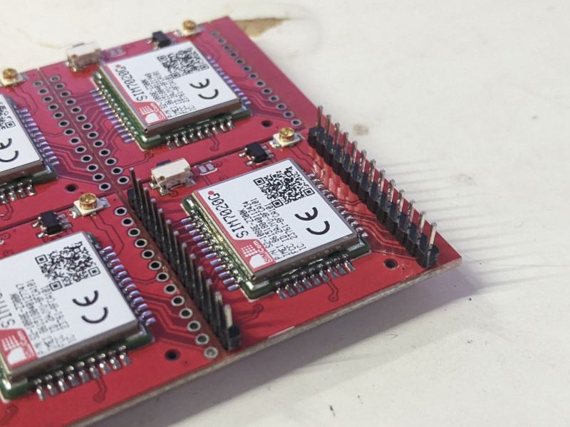

# NGS1095 Dat 

* Pin pitch 2.0 mm 

- Power VIN input = option 231 @ [[LDO-dat]]

## pin definitions 

Pin Definitions R2:

| Left | note left                     | Right | note right      |
| ---- | ----------------------------- | ----- | --------------- |
| VRXD | UART1 via. logic shifter      | 2TX   | uart2 pins      |
| VTXD | UART1 via. logic shifter      | 2RX   | uart2 pins      |
| IO0  |                               | Vusb  | USB_power       |
| VDD  | 3.3V from module internal LDO | DP    | USB_dp          |
| RI   | UART1                         | DM    | USB_dm          |
| DTR  | UART1                         | GND   | USB_gnd         |
| DCD  | UART1                         | RST   | Reset           |
| CTS  | UART1                         | ADC   | ADC             |
| RTS  | UART1                         | Vext  | VDD_ext         |
| RX   | UART1                         | STAT  | status          |
| TX   | UART1                         | NET   | network         |
| NC   |                               | GND   |                 |
| M_K  | Powe ON/OFF Key               | VIN   | ~18V / Iq=1.8uA |

### group pin explanation:

| pins                       | Note                                                                                                   |
| -------------------------- | ------------------------------------------------------------------------------------------------------ |
| U1V_RXD, U1V_TXD           | uart1 txd and rxd pin via logic shifter, 5V compliant                                                  |
| IO0                        | GPIO 0                                                                                                 |
| VDD                        | VDD 3.3V from module                                                                                   |
| RI DTR DCD CTS RTS RXD TXD | Full UART1 pins, extra pins can be used as GPIO or other control functions, please refer to datasheet. |
| M_K                        | external MCU control pin, pull high to power on module                                                 |
| U2TXD, U2RXD               | uart2 pins, can be used for upgrade firmware.                                                          |
| VUSB, DP, DM, GND          | USB debug pins                                                                                         |
| RST - reset, ADC           | analog read pin, V_ext: power supply logic, STAT: status logic, NET: netlight                          |
| GND, VIN                   | Power supply in, support up to 12V.                                                                    |

## Pin Soldering Side 

on sim card side  

on module side

# reference 

- [[SIM7020-DAT]] - [[SIMCOM-dat]]

- [[low-power-dat]] - [[LDO-dat]]

- [[SIM7020]]