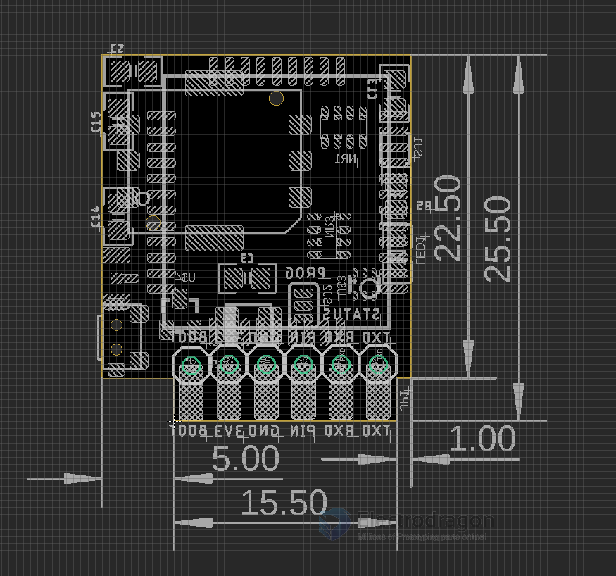
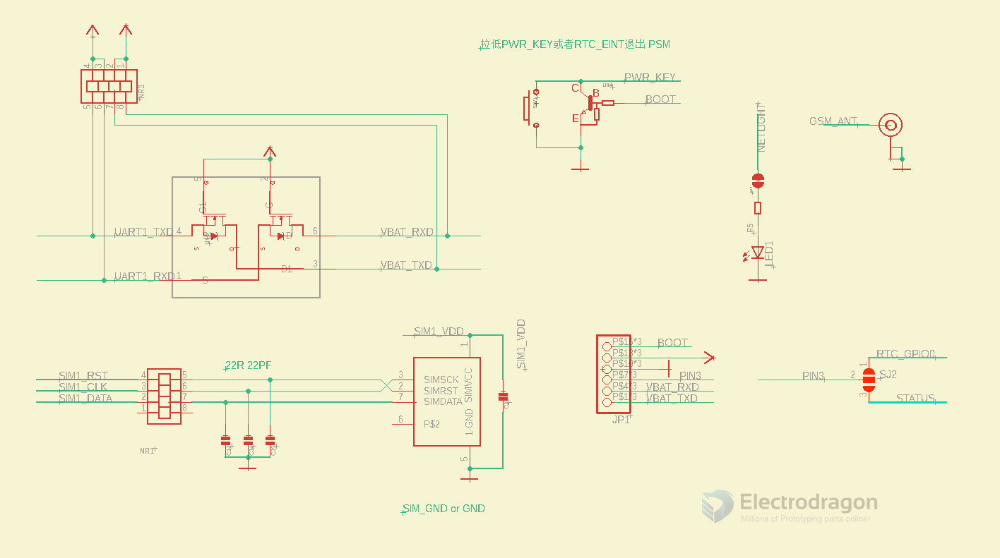

# Board Info 

### Pin Definitions 

BOOT 3V3 GND PIN RXD TXD

Pin Definitions of SIM7020-V: 
* TXD RXD PIN GND 3V3 BOOT

### Power supply 
- 3V3 500mA
- Logic level is the sme 3V3

### Common Debug Error

- you must use NBIOT Card, normal phone card may not work
- if the card no service, system will shut power at CREG 0,2

## Dimension / Pins / Schematic 

# reference 
- [[SIM7020-DAT]]
