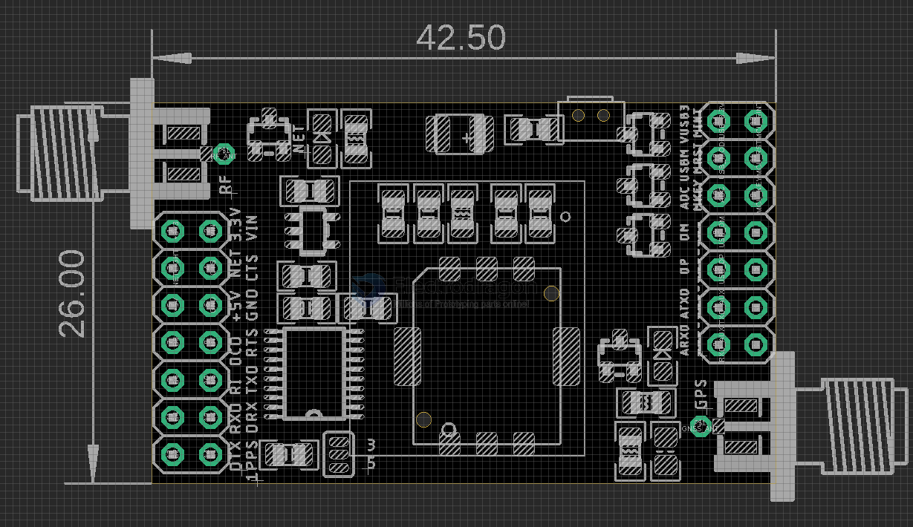

# NGS1105-dat

## Board map 

Pin Definition:

| Pins                 | Note                                           | Logic                |
| -------------------- | ---------------------------------------------- | -------------------- |
| DTX / DRX            | Debug TXD and RXD                              | (via logic shifter)  |
| TXD / RXD            | UART Serial TXD and RXD (AT commands)          | (via logic shifter)  |
| ATX / ARX            | RXD and TXD AUX                                |                      |
| 1PPS                 |                                                | (via logic shifter)  |
| RI / DCD / RTS / CTS | RS-232 Pins                                    | (via logic shifter)  |
| DM / DP              | USB Port                                       |                      |
| VUSB3                | VDD USB 3.3V                                   |                      |
| USBM                 | USB_MODE                                       |                      |
| ADC                  |                                                |                      |
| MKEY MRST MINT       | MCU Control Boot pin, Reset pin, Interrupt pin |                      |
| +5V                  |                                                | need external supply |
| 3V3                  |                                                | from board LDO       |

### Quick Wiring 
* Connect VIN GND TXD RXD to send AT Commands

###  LEDs
* Both on board LEDs may NOT work due to the module developing firmware, LEDs reserved for future functions only

## Specifications

* Hardware version - BC20NA-04-STD
* Band B5 B8 
* Location supports GPS Beidou SBAS

## Usage

### Sleep Mode

* Module should automatically enter into sleep mode periodically 60 seconds
* Wake up by AT commands serial input, or pressing button
* Please check relevants documents or contact us if you have any other questions.

## ref 

- SDK documents - https://github.com/Edragon/quectel-BC20

- [[BC20-dat]]

- at commands refer to [[quectel-at-dat]]

- legacy wiki page - https://w.electrodragon.com/w/Category:BC20
