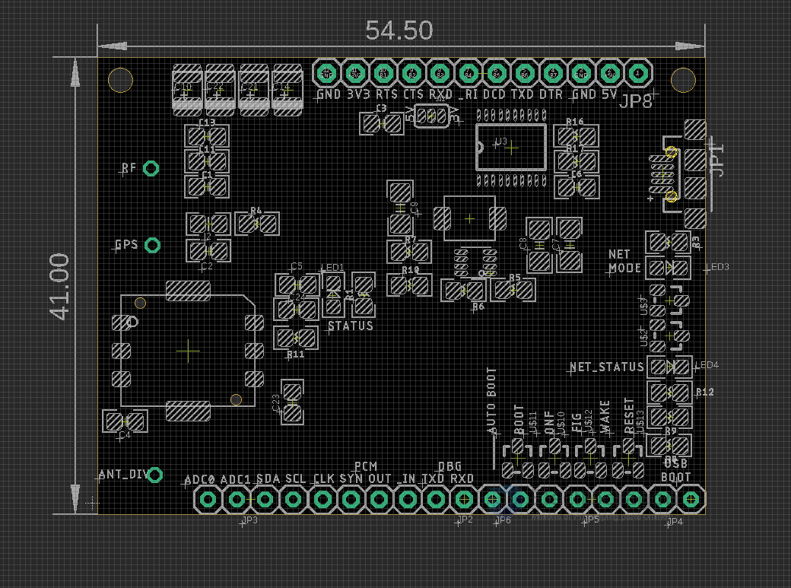

# NGS1108-dat

- short JP6 two-pins to enter auto boot mode 

## Logic level selector 

- 5V or 3.3V 
- also can float it, it works fine

## USB Debug

- plugin to have three serial port 

## LED Indicators 

- Status 
- Network_status 
- Net_mode 

## Antenna Connector 

- RF
- GPS
- Ant_Div

## Pin headers 

- Top 
- Bottom 

## Demo 

## ref 

- [[NGS1108]]