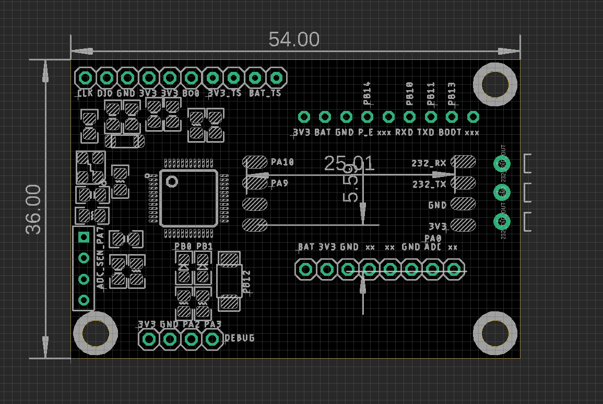
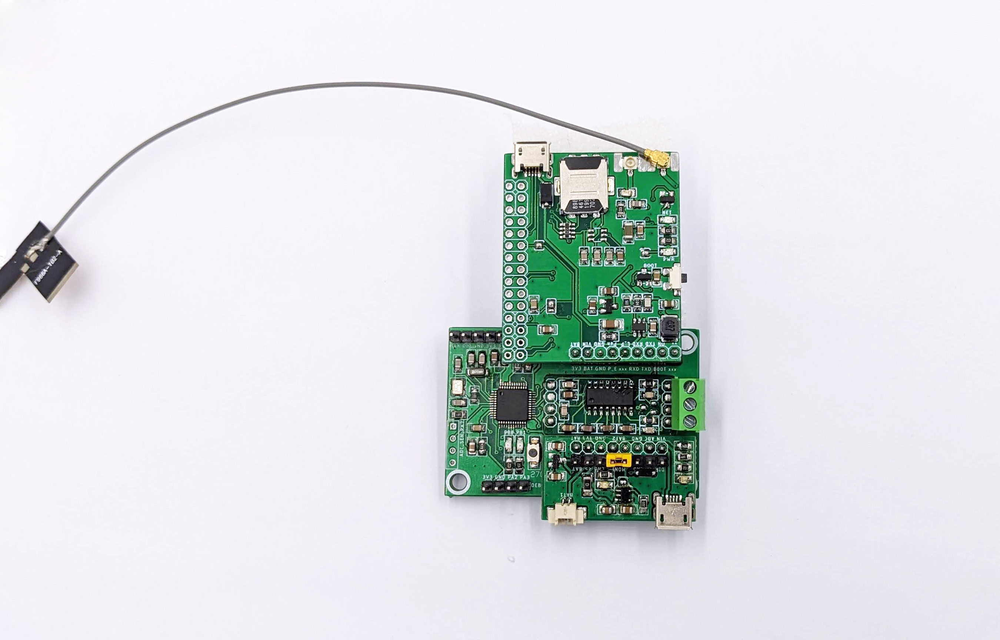

# GNS1112 DAT

STM32 Low-Power Wireless System Board

## Hardware

### Board Features 
- Pre-included board RS-232 [[DPR1084-DAT]]
- Optional stack board:
  - based on our current [[M2M-interface-dat]]
  - SIM7020G
  - SIM7070G
  - SIM7080G

### Pin Definitions 

Sensors pins from top to bottom: 3V3 PA7 xx GND

SIM Interface: 
- PB14 = power enable 
- PB10 = SIMRXD
- PB11 = SIM TXD
- PB13 = module boot 

RS-232 Interface:
- PB10
- PB9

Debug Interface: 3V3 GND PA2 PA3

Programming Interface: CLK DIO GND 3V3 BOOT

### Stackable with SIM7070G

### Ref 

- [[STM32L151]]