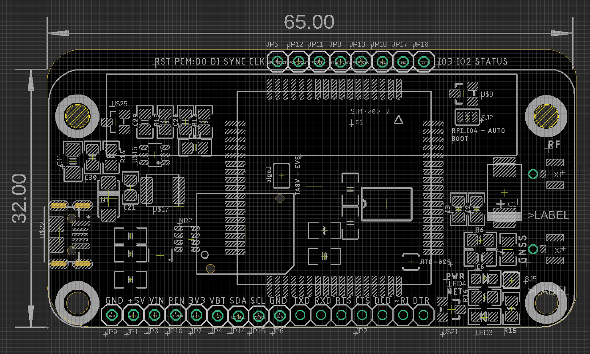

# NGS1119-dat 

## Board map 

bottom pin definitions 
- GND
- +5V
- VIN
- PEN
- 3V3
- VBT
- SDA
- SCL
- GND
  
full serial interface  
- TXD
- RXD
- RST
- CTS
- DCD
- RI
- DTR 

top pin definitions 
- RST
- PCM: DO DI SYNC CLK
- IO3
- IO2 
- Status 

## jumper select 

- SJ2: set boot mode - RPI_IO4 or AUTO 
- back SJ: set logic level - 3V3 or VBAT 
- P26 - DTR: RPI IO26 to read DTR pin

## Antenna 

- RF
- GNSS

## LED Indicator 

- PWR power indicator 
- NET network status 

## ref 

- [[SIMCOM-AT-DAT]]

- [[NGS1119]]

