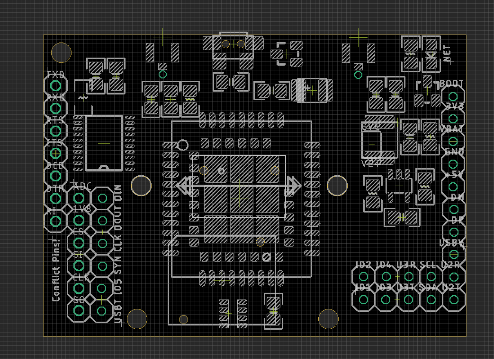
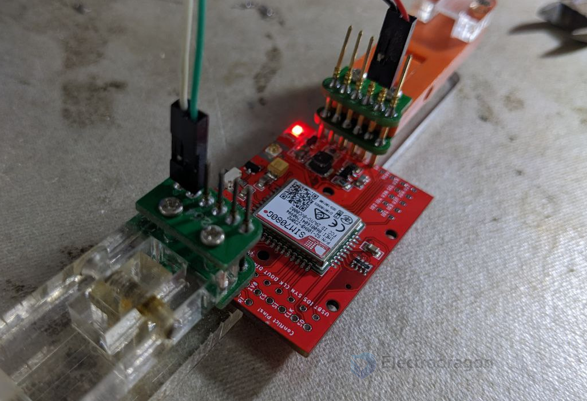

# NGS1128-DAT

## Hardware 

Lead out all the function pins

left column pins 
- TXD / RXD / RTS / CTS / DCD / DTR / RI (via logic shifter)

bottom-left pins 
- ADC / 1V8 / CS / SI / CLK / SO (SPI)
- DIN / DOUT / CLK / SYNC (PCM) / IO5 / USB_BOOT

bottom-right pins 
- IO1 / IO3 / U3T / SDA / U2T
- IO2 / IO4 / U3R/ SCL / U2R

right column pins 
- MCU_BOOT / EXT_3V3 / VBAT / GND / 5V / DM / DP / USB_V

## Demo 

## Quick Setup 

| Functions            | Setup and Pins             |
| -------------------- | -------------------------- |
| power supply         | GND/5V                     |
| serial communication | TXD / RXD                  |
| logic shifter level  | float                      |
| serial baudrate      | 9600                       |
| network              | CAT-M / NBIOT              |
| location             | GNSS                       |
| boot mode            | press-button / mcu-trigger |

## ref 

- Driver: [[git]] simcom_driver
- chip documentation: [[git]] SIMCOM_SIM70X0

- [[mqtt-dat]]
- [[NGS1128]] - [[SIM7080-dat]]
- [[SIMCOM-AT]]
- [[SIMCOM-AT-GNSS]]
- https://w.electrodragon.com/w/SIM7080

- [[BTB-dat]]