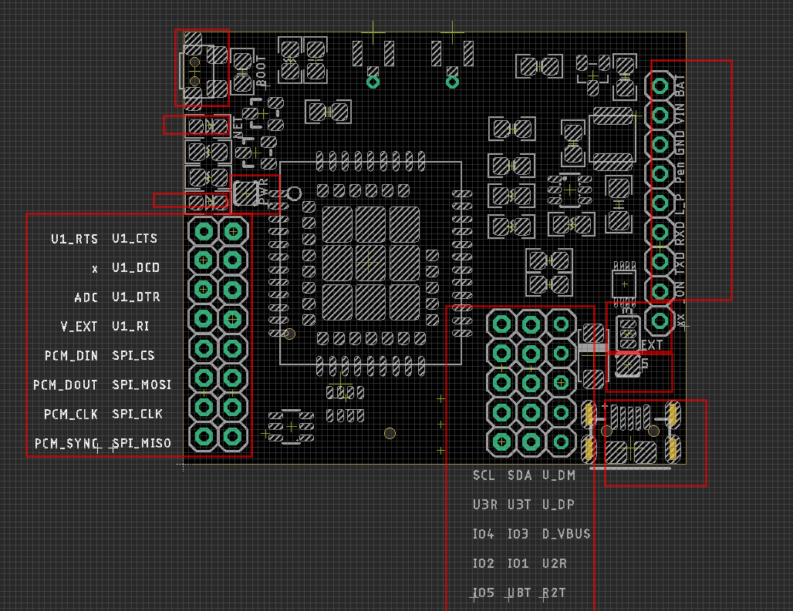
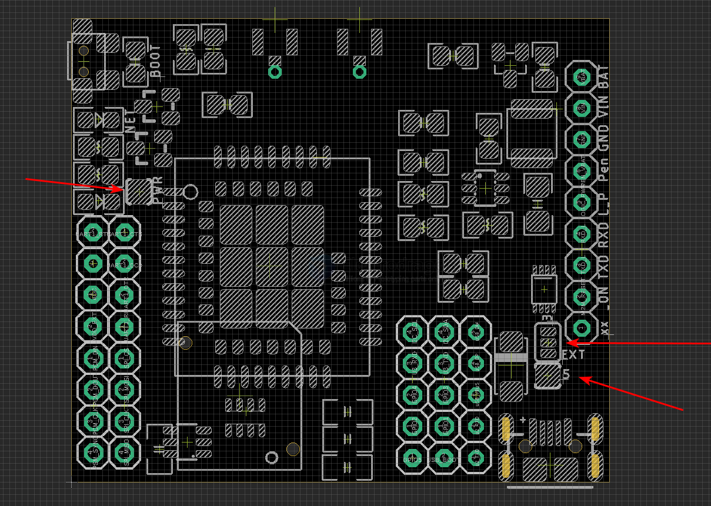
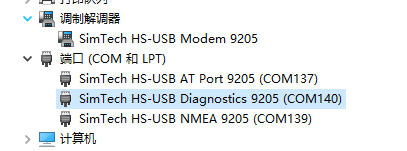

# NGS1129-DAT

based on chip [[SIM7080G-dat]]

- [[NGS1129-dat]] - [[NGS1128-dat]] - [[SIM7080-dat]] - [[SIMCOM-AT-dat]] - [[SIMCOM-dat]]

- [[M2M-dat]] - [[antenna-dat]]

- [[location-dat]]

## Hardware 

- Simplified Connection: TXD / RXD / GND / VIN
- VIN: 4.2-18Vin
- default TXD / RXD logic at 3.3V
- Boot: hold down boot button for 2 seconds, or pull key pin to up for 2 seconds
- on board netlight led and power led 
- manual reset module button 

### Wiring 

- `VIN` to 5~16 VDC
- `GND` to GND
- `TXD` - TXD
- `RXD` - RXD

or connect USB cable to the module which has internal [[serial-dat]]

Optionally: 

- `Logic_Power` (L_P) to external 5V or NC if use internal 3V3 
- `BAT` to directly battery power supply 
- `PEN_VBAT` turn on board power on or off via enabling DC-DC regulator
- `ON (M2M_RESET)`: turn on/off the M2M module by an external GPIO

### jumpers 

- `PWR jumper`: select ON/OFF for the power LED
- `3/5 jumper`: select on board 3.3V or other 5V power (USB or the external pin)
- `5V jumper`: USB 5V power supply to Logic

- [[M2M-interface-dat]]

## Use Guide 

### boot the module 
- hold down the top-middle small button for 2 seconds to boot the module
- or pull the `ON (M2M_RESET)` pin to high for 2 seconds to boot the module 

### Use GNSS
- check at [[SIMCOM-AT-GNSS-dat]] - [[SIMCOM-AT-location-dat]]

### Use as a Modem and COM PORT

- power via USB

## test default 

- USB-TTL cable with-in CH340/PL2303TA for pin-test, or simple USB cable to on-board USB port
- 5V/GND/TXD/RXD works with internal 3.3V logic left

## mode 

- `DTR high`: enters sleep mode
- `DTR low`: wakes the module
- `RI`: externally wakes the host with a 120 ms low pulse

## Demos
- Test with ESP32: https://twitter.com/electro_phoenix/status/1635565366595428352

## ref 

- [[NGS1128]] - [[NGS1129]]

- [[NGS1128-DAT]] - [[SY8120]]