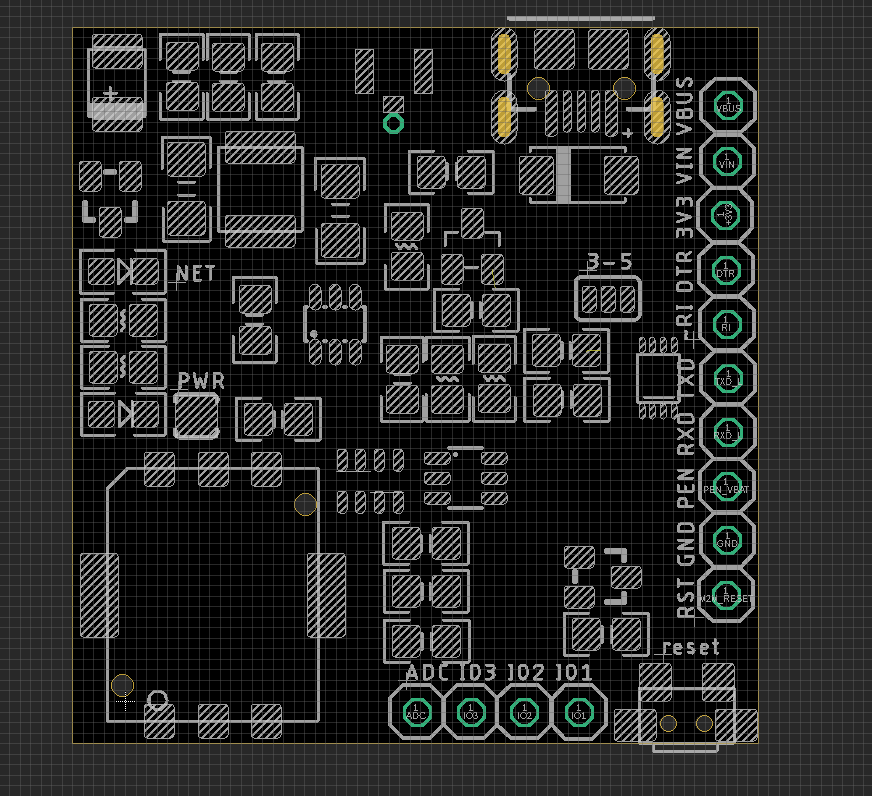
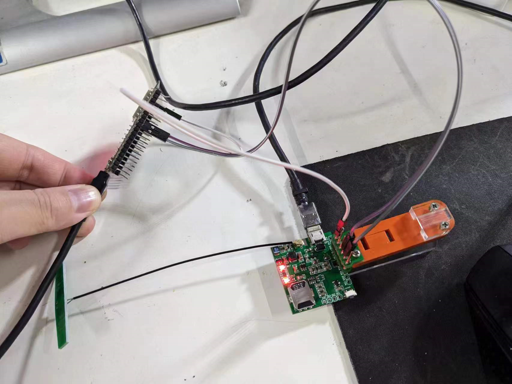

# NGS1131 DAT 

- [[A7670-DAT]]

- [A7670 LTE CAT-1 GSM Mini Module](https://www.electrodragon.com/product/a7670-lte-cat-1-gsm-mini-module/?attribute_pa_simcom=a7670c)

## Hardware

- Hold down reset button for 2 seconds to boot the module 
- pull up   reset pin    for 2 seconds to boot the module (by external MCU)

### Pin Definitions 

| Pin  | Functions                                    |
| ---- | -------------------------------------------- |
| RST  | gpio_control_reset                           |
| GND  | board power supply ground                    |
| PEN  | on board dcdc power supply enable default on |
| RXD  | UART receive via logic shifter               |
| TXD  | UART send via logic shifter                  |
| ~RI  | UART RI pin                                  |
| DTR  | UART DRT pin                                 |
| 3V3  | on board 3.3V LDO output                     |
| VIN  | Power input up to ~18V                       |
| VBUS | Power supply from USB port                   |

### Power Supply 

- VBUS can be a USB power supply. 
- VIN can be ~18V 2A external DC power supply 
- VBAT does not lead out, so you basically can not use it unless you hack with a jumper wire. Please note we didn't mention the board can use VBAT in the product description.
- 3.3V for on board logic or power external

Note 
- When use VIN input, UART serial logic level power +5V should be supplied via VUSB

| VIN      | VBUS_+5V              | Module VBAT       | 3.3V              |
| -------- | --------------------- | ----------------- | ----------------- |
| supplied | external provide need | on board provided | on board provided |
| x        | supplied              | on board provided | on board provided |

### Wiring UART communication with ESP32

| ESP32      | note         | A7670               |
| ---------- | ------------ | ------------------- |
| IO18 IO19  | UART         | A7670C              |
| Vin / Vusb | Logic Level  | A7670C logic        |
| Vin / Vusb | Power Supply | A7670C Power Supply |

### Wiring UART communication with USB-TTL

auto turn ON, RXD->RXD, TXD->TXD, 5V-VIN, GND-GND, 115200 bps, net-led constant ON

    *ATREADY: 1

    +CPIN: SIM REMOVED

    +CPIN: SIM REMOVED

### Wiring USB port 

auto turn ON, USB will list 3 COMs - [[A7670-dat]]

## demo video 

- [Sim7670 usb-ttl bridge debug](https://t.me/electrodragon3/200)
- [Sim7670 usb boot guide](https://t.me/electrodragon3/199)

## ref 

- [[M2M-dat]] - [[SIMCOM-dat]] - [[serial-dat]] - [[Logic-level-shifter-dat]]

- [[NGS1131]]
