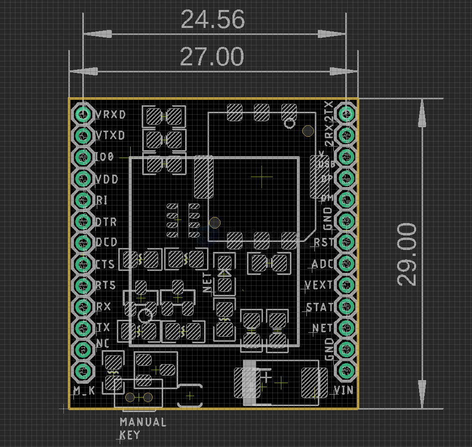

# NGS1135-dat

[sim7020e-4g-nbiot-mini-development-board](https://www.electrodragon.com/product/sim7020e-4g-nbiot-mini-development-board/)

- hardware and most board info please refer to module [[NGS1095-dat]]

- [[SIM7028-dat]] - [[NBIOT-dat]] - [[LTE-M-dat]] - [[LTE-dat]] 

software - [[SIMCOM-AT-dat]]

[[SIM7020-dat]] - [[SIM7028-dat]]

- [[NGS1096-dat]] - [[NGS1095-dat]] - [[NGS1135-dat]]

## pin definitions 

functions - [[logic-level-shifter-dat]] - [[serial-dat]] - [[SIMCOM-USB-dat]] - [[SIMCOM-dat]]

- [[RTC-dat]] - [[CONN-SIM-dat]]

## ref 

- [[SIM7020-dat]]

- [[capacitor-dat]]

- [[NGS1135]]

