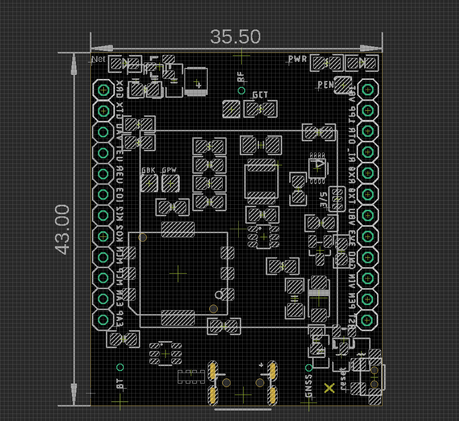

# NGS1141-dat

## Info

[product url - A7670 LTE CAT-1 GSM Mini Module V2](https://www.electrodragon.com/product/a7670-lte-cat-1-gsm-mini-module/)

- refer to the full series here [[A7670-dat]]

### Board Map, Dimension, Pins, chip info, Use Guide, Setup Jumper, etc.

Board map 

Update logs 

- well supported for [[GNSS-dat]] and [[bluetooth-dat]], at open area locating timing by GNSS is around 5-15 seconsds

- [[SIMCOM-AT-location-dat]]

## Applications, category, tags, etc. 

## Demo Code and Video

## ref 

- old version [[NGS1131-dat]]

- [[NGS1141]] 

