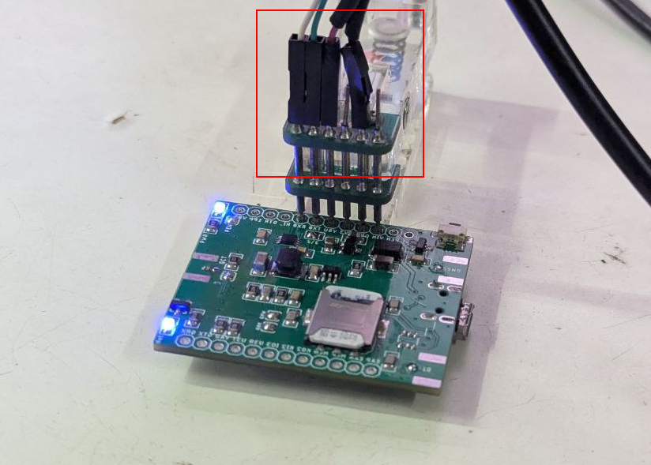

# NGS1141-dat

## Info

[product url - A7670 LTE CAT-1 GSM Mini Module V2](https://www.electrodragon.com/product/a7670-lte-cat-1-gsm-mini-module/)

- refer to the full series here [[A7670-dat]]

### Board Map, Dimension, Pins, chip info, Use Guide, Setup Jumper, etc.

Board map 

| left     | right |
| -------- | ----- |
| G_RXD    | VBAT  |
| G_TXD    | 1PPS  |
| VBAT_ADC | DTR   |
| U3TX     | RI    |
| U3RX     | TXD   |
| IO3      | RXD   |
| MK_IN2   | VBUS  |
| MK_OUT2  | 3V3   |
| MIC_N    | GND   |
| MIC_P    | VIN   |
| EAR_N    | PEN   |
| EAR_P    | Reset |

Update logs 

- well supported for [[GNSS-dat]] and [[bluetooth-dat]], at open area locating timing by GNSS is around 5-15 seconsds

- [[SIMCOM-AT-location-dat]] - [[SIMCOM-at-dat]]

Power supply == 18V 2A in [[dcdc-down-dat]] section Option 8201

## jumper list 

- GCT == GPIO4 -> GNSS_PWR_CTRL
- GBK == GNSS_VBKP  (voltage backup)-> VDD_EXT
- GPW == 1V8_GNSS -> VDD_EXT
- 3/5V == logic level 3V3 or 5V
- PEN == Power led indicator enable 

## Applications, category, tags, etc. 

## Demo Code and Video

[[serial-dat]] testing: 

- RX0 / TX0 / VBUS / GND 

## ref 

- [[A7670-dat]]

- old version [[NGS1131-dat]] - [[NGS1132-dat]]

- [[NGS1141]] 

