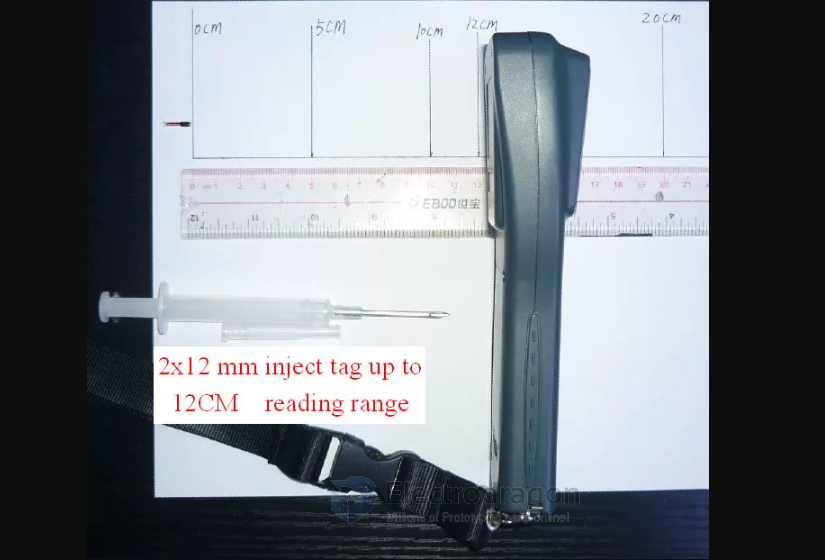

# NID1020-faq-dat.md

#### can the antenna be smaller? 

- NO, unless to cut the sensing distance 

#### can it detect the card staying in the sensing area? 

- No 

#### Can be integrated into plastic case? 

Yes, below is an animal checker device.

And an animal inject tag. 

#### how to design a system based on it 

