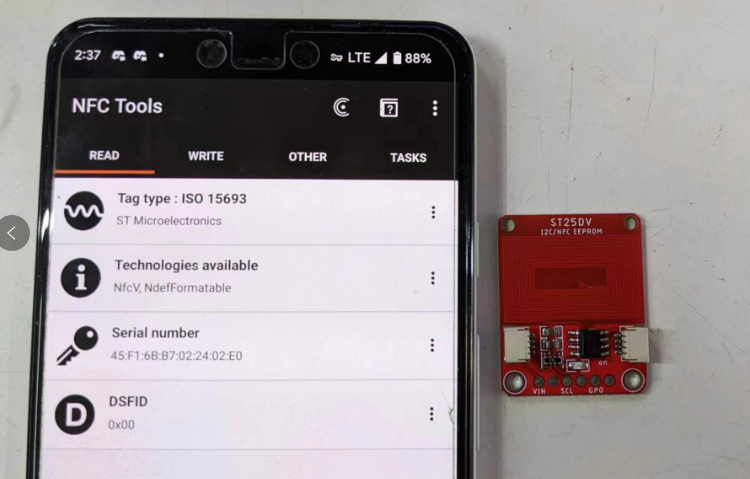
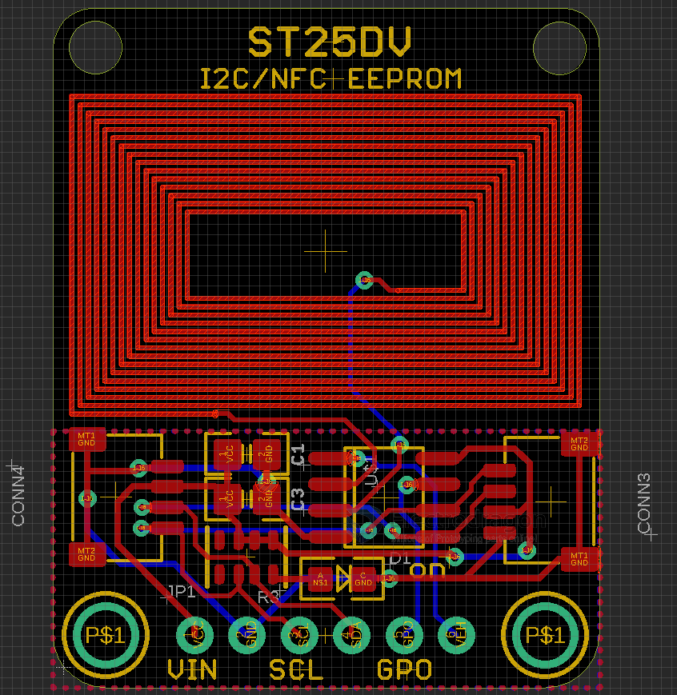

# NID1026 DAT

- [[ST25DV-dat]]
- https://www.electrodragon.com/product/nfc-tag-module-read-write-st25dv-13-56mhz/

android NFT supported phone can use APP called "NFC tools" to read write this PCB tag

## Board Map

Socket Pin Definitions From Top to Bottom

| Left socket | right Socket |
| ----------- | ------------ |
| GND         | SCL          |
| VCC         | SDA          |
| SDA         | VCC          |
| SCL         | GND          |

Bottom Pins : VCC GND SCL SDA GPO VEH

For pin GPO and VEH please refer to chip [[ST25DV-dat]]

- LPD low power control pin (NOT available in this chip version)

## Demo code

### STSW-ST25DV001

- Firmware for ST25DV-DISCOVERY kit
- https://www.st.com/en/embedded-software/stsw-st25dv001.html
- https://my.st.com/content/ccc/resource/technical/software/firmware/group0/40/c4/86/d8/42/09/44/af/STSW-ST25DV001%20firmware/files/stsw-st25dv001.zip/jcr:content/translations/en.stsw-st25dv001.zip

### Arduino

[[STM32duino]]

- https://github.com/stm32duino/ST25DV

### Our demo code please find at

https://github.com/Edragon/Arduino-STM32

## Demo video

- [Official CHIP demo video please referring to here](https://www.youtube.com/watch?v=WyNey42oIHE&ab_channel=STMicroelectronics)

## ref

- [[NFC-dat]]
- [[ISO 15693]]
