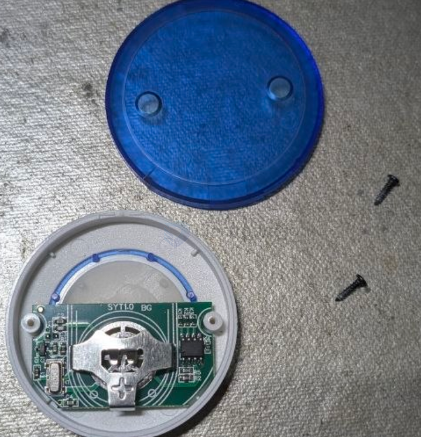
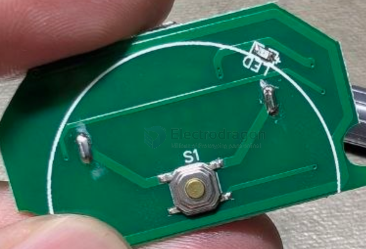
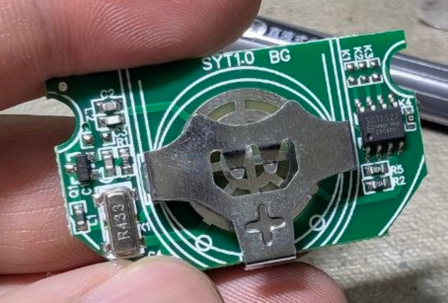
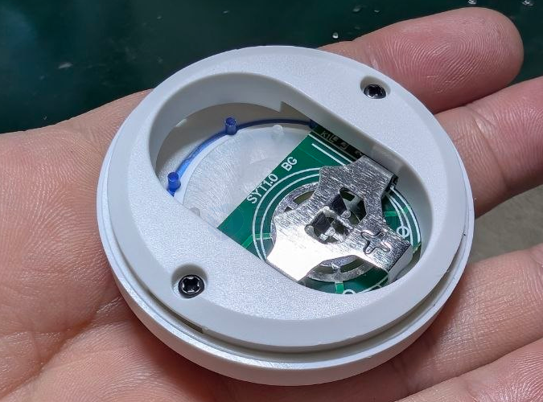

# NRF1003-dat.md

- [[RF-dat]]

## Info

product url - [Press Button Round RF ASK Transmitter 433mhz w/Adhesive](https://www.electrodragon.com/product/press-button-round-rf-ask-transmitter-433mhz-w-adhesive/)

### Board Map, Dimension, Pins, chip info, Use Guide, Setup Jumper, etc.

note - install and prepare [[CR2032-dat]] coin battery before starting to use. 

on board chip refer to [[EV1527-dat]]

- [[battery-size-dat]] - [[battery-dat]]

## Applications, category, tags, etc. 

## Demo Code and Video

## ref 

- [[NRF1003]] 

- [[RF-link-dat]]

