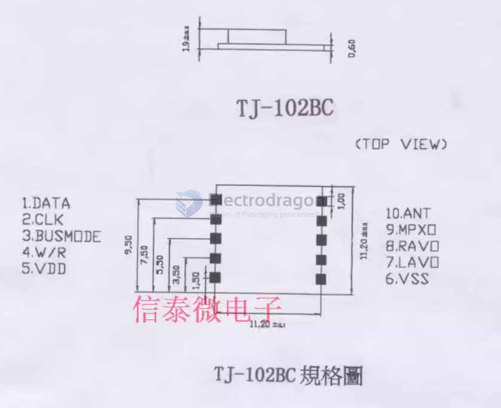

# NRF2007-dat

legacy wiki page - https://w.electrodragon.com/w/Category:FM

TEA5767 radio module, car radio module, high-quality audio radio module

Product features: world channels, frequency range from 76 to 108MHZ automatic digital tuning. High sensitivity, high stability, low noise, low power consumption. Radio module, radio module, ultra-small size.

Product application: Radio modules are widely used in consumer electronic audio-visual products, household appliances, etc.

For example, MP3PLAYER, MD, CD/MP3PLAYER, PORTABLVCD/DVD, MOBILEPHONE, PDA, electronic dictionary, digital refrigerator, car audio.

**Comprehensive advantages:**

1. Special antenna induction technology to ensure high sensitivity and high stability.

2. A variety of models, easy to choose, can be used with various solutions and customary usage.

3. Price advantage, PIN to PIN replacement of imported products

## SCH 

## ref 

- [[TEA5767-dat]] - [[FM-dat]]

- [[NRF2007]]