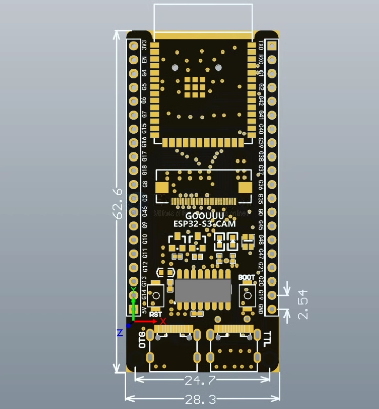
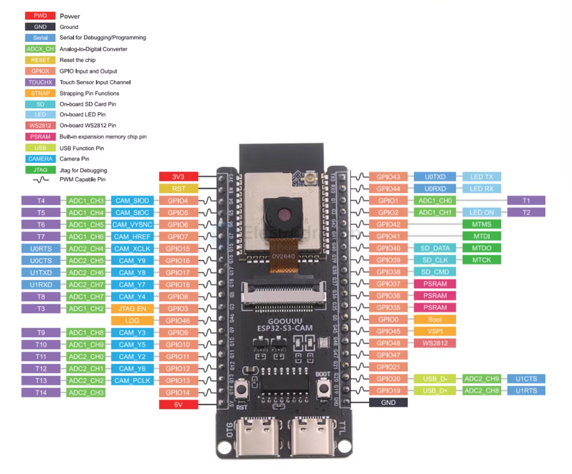
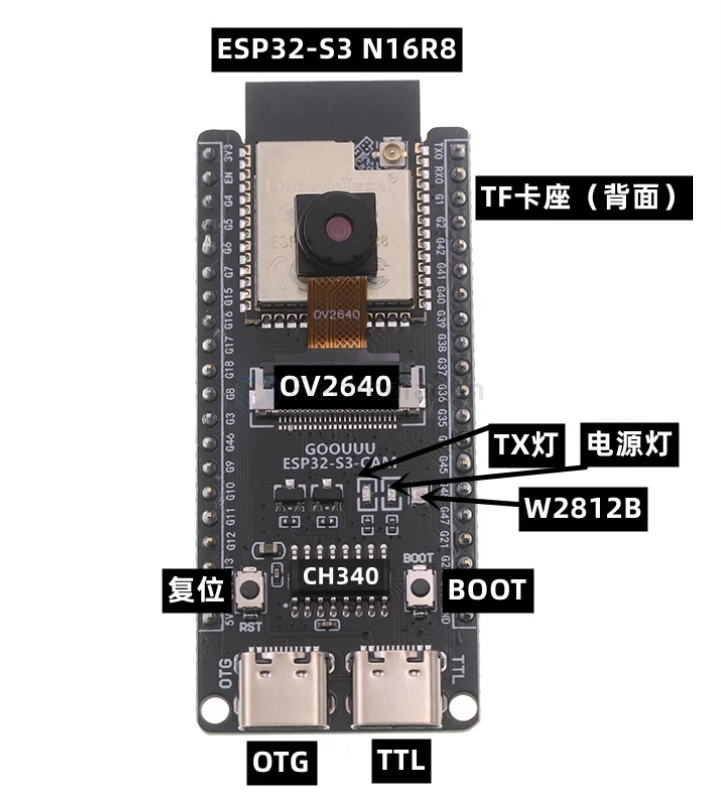
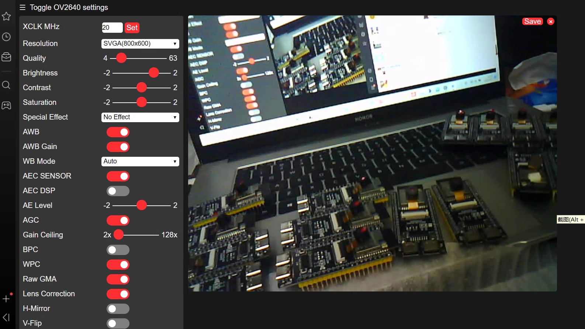

# NSP1001-dat

## Feature 

- support [[arduino-ide-dat]] - [[micro-python-dat]]

## Board map and dimension 

## IO definitions 

## Demo 

- running camera 
  

## ref 

- [[ESP32-S3-dat]]

- [[ESP1001]]