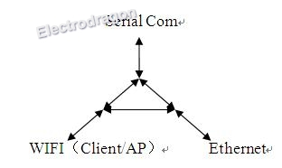
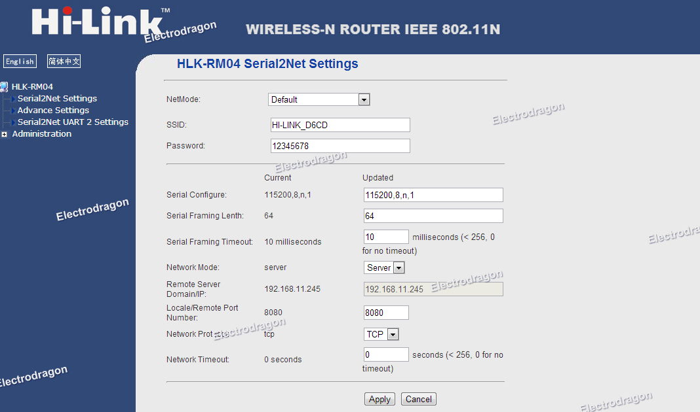
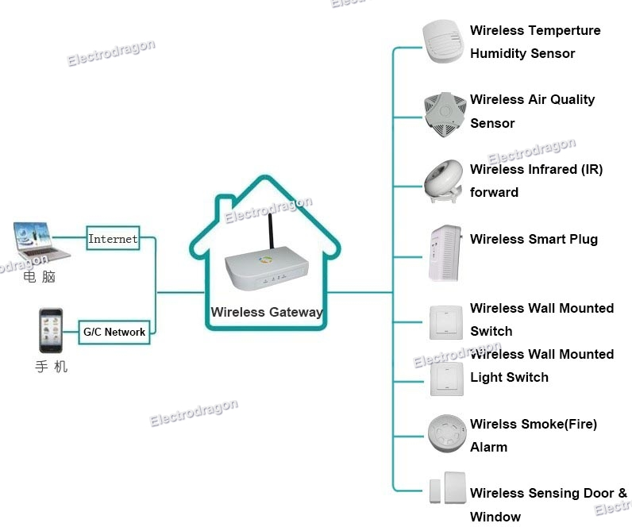

# NWI1002-dat

- [[openwrt-dat]]

## Info

[product url - Wi04 Wifi Module (Wifi / Ethernet / Serial UART)](https://www.electrodragon.com/product/wi04-wifi-module/)

### Board Map, Dimension, Pins, chip info, Use Guide, Setup Jumper, etc.

Configuration via Web browser:

Application Map:

## Applications, category, tags, etc. 

- [[NWI1005-dat]]

## Demo Code and Video

## ref 

- [[NWI1002]] 

- [[ralink-dat]]

- [legacy wiki page ](https://w.electrodragon.com/w/WI04_Wifi_Module)

https://www.electrodragon.com/w/WI04Kit

