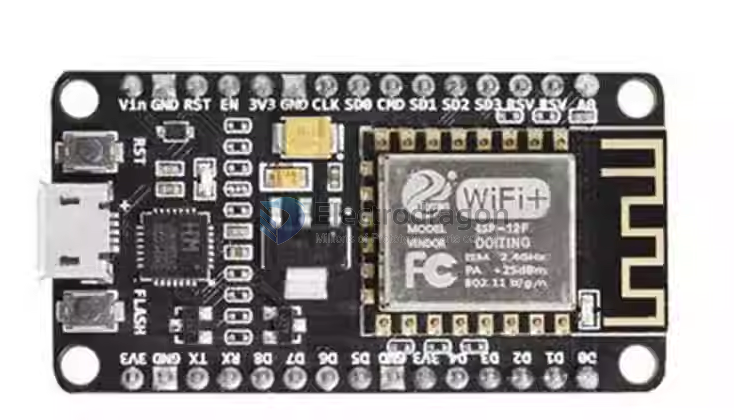

# NWI1044-dat 

https://www.electrodragon.com/product/nodemcu-lua-amica-r2-esp8266-wifi-board/

- [legacy wiki page](https://w.electrodragon.com/w/ESP8266_NodeMCU_Dev_Board#R2_Version_Flash_Note)

## Note 

- NO need to install driver for CH341 (replaced by CP2102)
- NO need to flash firmware when you get it and use on first time. This is different with version R1.
- To use on the first time, NO need to flash the firmware, run command file.remove("user.lua") as instructed, see the attached image. 
- Baud rate 9600
- To flash R2, please see the update on our Nodemcu wiki page. Baud rate 115200
- High quality USB cable is needed for this board to give high current supply, otherwise your board won't be recognized.

## IDE 

ESPlorer 

## ref 

- Open source support: www.nodemcu.com
- [[NWI1044]] - [[LUA-dat]]