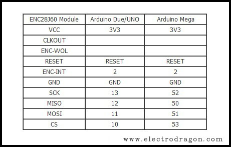
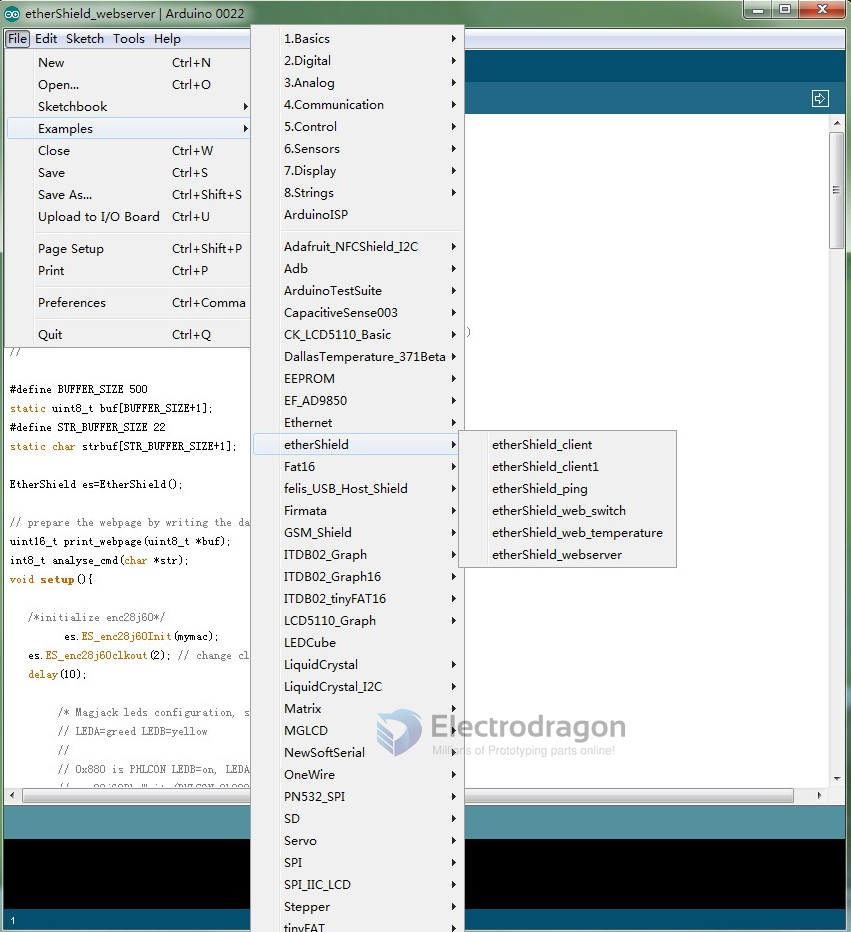
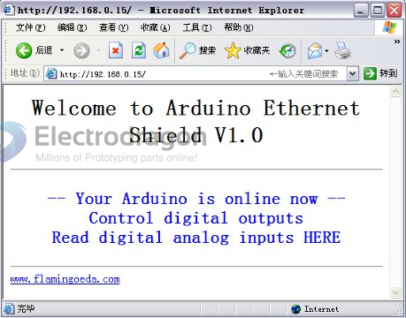

# NWI1048-dat

## Board Info

## Pin Definitions

| Left        | right  |
| ----------- | ------ |
| 1 CS        | 2 RST  |
| 3 SI        | 4 SCK  |
| 5 INT       | 6 SO   |
| 7 NC        | 8 CLK  |
| 9 VIN / VCC | 10 GND |

## Wiring to Arduino 

## Applications 

### Arduino as Ethernet Web Server

* Download the ENC28J60 library. Unzip the library to IDE library.
* Connect the ENC28J60 Mini Ethernet Module to Arduino, notice the switch is choosing 3.3V or 5V. 
* The IO as below: CS - 10 , SI - 11 , SO - 12 , SCK - 13
* Select the IDE arduino-xxx/example/etherShield/etherShield_webserver.

* Plugin the USB to Arduino , and then input the IP such as : http://192.168.1.15/. It will show as below informaion.

## tutorial

https://www.electrodragon.com/read-temperature-online-from-your-enc28j60-module-with-ds18b20/

## ref

- [[NWI1048]]

- HR911105

- [[ENC28J60-dat]]
