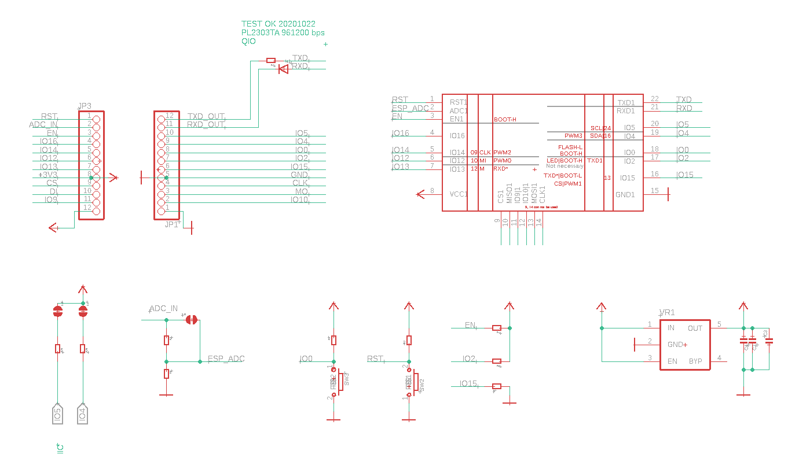
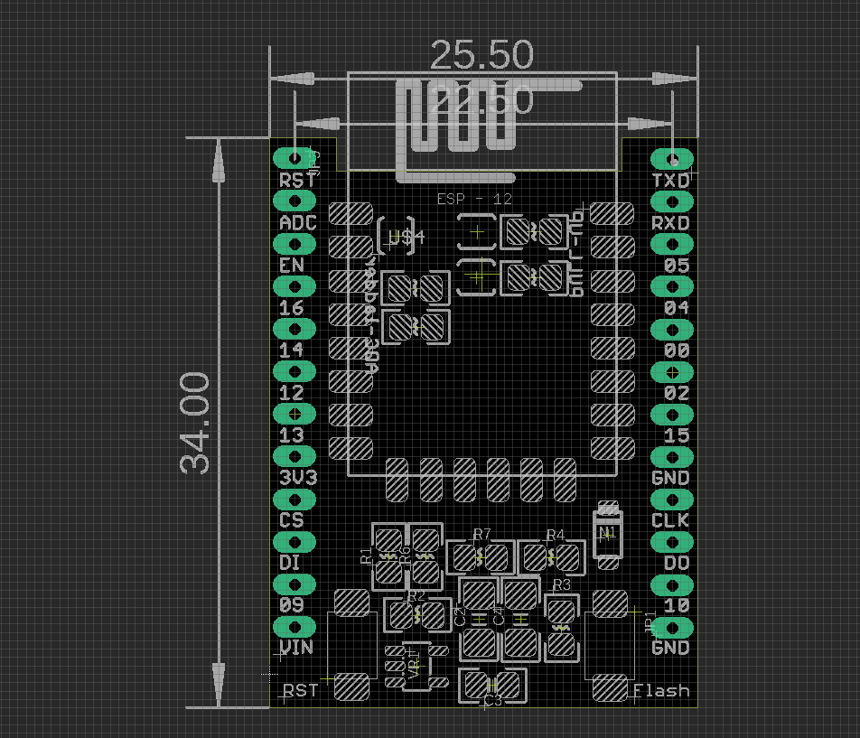

# NWI1050-DAT

## SCH

back side functions:
- IO4 IO5 pull up resistors via jumpers 
- ADC resistor ladders via jumppers 

## Dimension 

## ref 

- [[ESP-SDK-dat]]
- https://www.electrodragon.com/w/Category:ESP8266_Hardware#Perpherial_Schematic
- flash guide - https://www.electrodragon.com/flash-firmware-for-nodemcu-on-esp-12f-with-breakout-board/

## Version Log 

- R2 version support not only ESP-07, ESP-12 but also new ESP-12F, which has extra 6 pis (SPI and I/Os)
- Fixed: Note pin IO4 and IO5 is switched, not same as ESP-12F pinout (we used early version pinout).