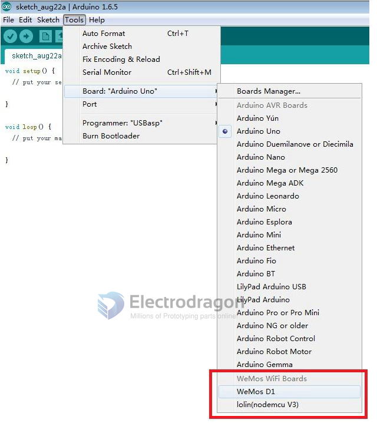
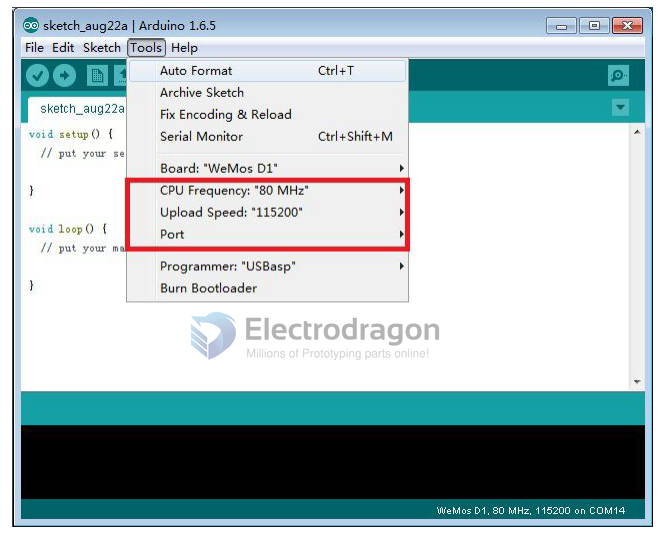
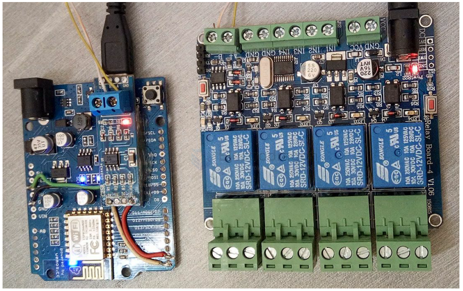

# NWI1066-dat

https://www.electrodragon.com/product/d1wifi-arduino-based-board-arduino-nodemcu-compatible/

- legacy wiki page - https://w.electrodragon.com/w/Arduino-ESP8266
- legacy wiki page 2 - https://w.electrodragon.com/w/Category:ESP8266_Boards


## Pins

| 引腳        | 說明                                   | IC 內部引腳 |
| ----------- | -------------------------------------- | ----------- |
| D0(RX)      | 串口接收                               | GPIO3       |
| D1(TX)      | 串口發送                               | GPIO1       |
| D2          | I/O, 不支持中斷，PWM， I2C 以及 1-wire | GPIO16      |
| D3/SCL/D15  | I/O，默認模式下，I2C 的 SCL            | GPIO5       |
| D4/SDA/D14  | I/O，默認模式下，I2C 的 SDA            | GPIO4       |
| D5/SCK/D13  | I/O，SPI 的時鐘                        | GPIO14      |
| D6/MISO/D12 | I/O，SPI 的 MISO                       | GPIO12      |
| D7/MOSI/D11 | I/O，SPI 的 MOSI                       | GPIO13      |
| D8          | I/O，上拉，低電平時，進入 FLASH 模式   | GPIO0       |
| D9/TX1      | I/O， 上拉                             | GPIO2       |
| D10/SS      | I/O， 下拉，SPI 時，默認的片選（SS）   | GPIO15      |
| A0          | AD 輸入，0-3.3V                        | ADC         |


* 所有的 IO 工作電平為 3.3V，可瞬間承受 5V
* 除 D2 外，所有 I/O 都支持中斷，PWM，I2C，跟 1-wire







## relay control 

```
#include <ESP8266WiFi.h>
#include <ESP8266WebServer.h>
#include <EEPROM.h>
#include <Ticker.h>

Ticker tickerflash;

// EEPROM helpers (write/read a struct/variable to EEPROM)
#define EEPROM_write(address, p) { \
  int i = 0; \
  byte *pp = (byte*)&(p); \
  for (; i < sizeof(p); i++) EEPROM.write(address + i, pp[i]); \
}
#define EEPROM_read(address, p) { \
  int i = 0; \
  byte *pp = (byte*)&(p); \
  for (; i < sizeof(p); i++) pp[i] = EEPROM.read(address + i); \
}

/* Set these to your desired credentials. */
static char Apid[9] = "NETGEAR"; // according to your router settings
static char softAPID[] = "KYSMART";
static char ApPass[10] = "zjky61448"; // according to your router settings

byte APip[] = { 192, 168, 20, 221 };      // according to your router settings
byte APGateWay[] = { 192, 168, 20, 254 }; // according to your router settings
byte APSubNet[] = { 255, 255, 255, 0 };

// Modbus-like commands to open relays
unsigned char openc[5][8] = {
  { 0x01, 0x06, 0x00, 0x01, 0x01, 0x01, 0x18, 0x5a}, // Relay 1 ON
  { 0x01, 0x06, 0x00, 0x01, 0x02, 0x01, 0x18, 0xaa}, // Relay 2 ON
  { 0x01, 0x06, 0x00, 0x01, 0x03, 0x01, 0x19, 0x3a}, // Relay 3 ON
  { 0x01, 0x06, 0x00, 0x01, 0x04, 0x01, 0x1b, 0x0a}, // Relay 4 ON
  { 0x01, 0x06, 0x00, 0x01, 0xff, 0xff, 0xd9, 0xba}  // All ON
};

// Modbus-like commands to close relays
unsigned char closec[5][8] = {
  { 0x01, 0x06, 0x00, 0x01, 0x01, 0x00, 0xd9, 0x9a}, // Relay 1 OFF
  { 0x01, 0x06, 0x00, 0x01, 0x02, 0x00, 0xd9, 0x6a}, // Relay 2 OFF
  { 0x01, 0x06, 0x00, 0x01, 0x03, 0x00, 0xd8, 0xfa}, // Relay 3 OFF
  { 0x01, 0x06, 0x00, 0x01, 0x04, 0x00, 0xda, 0xca}, // Relay 4 OFF
  { 0x01, 0x06, 0x00, 0x01, 0x00, 0x00, 0xd8, 0x0a}  // All OFF
};

byte TSwitch[] = { 0, 0, 0, 0 };
byte StatSave[] = { 0xff, 0xff, 0xff, 0xff }; // power-fail protection (retain state)

byte Switchnum = 10; // number of switches (was 13)
const byte SwitchIO[] = {
  D2, D3, D4, D5, D6, D7, D8, D9, D10, D11, D12, D14, D15
}; // list of switch pins

byte flashLed = D13; // breathing LED
int ledState = LOW;
char funcstr[800];

byte aptype = 0; // mode: 1 = AP, 0 = CLIENT

const char pageS[] PROGMEM =
  "<meta name=\"viewport\" content=\"width=device-width,initial-scale=1.0\">\r\n"
  "<meta http-equiv=\"Content-Type\" content=\"text/html;charset=utf-8\">\r\n"
  "<style type=\"text/css\">"
  "*{margin:3;padding:3;}"
  "input{width:90%;height:40px;font-size:20px;background:#999;}"
  "</style>"
  "<center><h2>欢迎使用 electrodragon 智能家居<br></h2><h3>%s<br><a href=\"http://www.it15168.com\">ZJKEYOU SMART HOME</a></center></h3>";

const char LineS[] PROGMEM = "%s<br><br><a href=\"/\">返回</a><br>";

// Create an instance of the server
ESP8266WebServer server(80);

// Toggle bit B of value v
int RevB(int v, byte b) {
  return (v ^= 1 << b); // toggle the POS bit of Number
}

void SaveSta() {
  EEPROM.begin(512);
  EEPROM_write(30, StatSave);
  EEPROM.commit();
  EEPROM.end();
}

void setSta(byte Aswitch, byte Sta) {
  byte i = Aswitch / 8;
  byte j = Aswitch % 8;
  bitWrite(TSwitch[3 - i], j, Sta);
}

void flash() {
  digitalWrite(flashLed, ledState);
  ledState = !ledState;
}

void handleRoot() {
  sprintf_P(funcstr, pageS,
    "<form action=/op1><input type=submit value=k1 开></form>"
    "<form action=/op2><input type=submit value=k1 关></form>"
    "<form action=/op3><input type=submit value=k2 开></form>"
    "<form action=/op4><input type=submit value=k2 关></form>"
    "<form action=/op5><input type=submit value=k3 开></form>"
    "<form action=/op6><input type=submit value=k3 关></form>"
    "<form action=/op7><input type=submit value=k4 开></form>"
    "<form action=/op8><input type=submit value=k4 关></form>"
    "<form action=/op9><input type=submit value=全 开></form>"
    "<form action=/op10><input type=submit value=全 关></form>"
  );
  server.send(200, "text/html", funcstr);
}

void op1() { opoper(0, 1, "k1 已开"); }
void op2() { opoper(0, 0, "k1 已关"); }
void op3() { opoper(1, 1, "k2 已开"); }
void op4() { opoper(1, 0, "k2 已关"); }
void op5() { opoper(2, 1, "k3 已开"); }
void op6() { opoper(2, 0, "k3 已关"); }
void op7() { opoper(3, 1, "k4 已开"); }
void op8() { opoper(3, 0, "k4 已关"); }
void op9() { opoper(4, 1, "全已开"); }
void op10(){ opoper(4, 0, "全已关"); }

void opoper(byte port, byte oper, char *str) {
  char funcstr1[100];
  if (oper == 1) {
    Serial.write(openc[port], 8);
  } else {
    Serial.write(closec[port], 8);
  }
  if (port < 4) {
    digitalWrite(SwitchIO[port], oper);
    setSta(port, oper);
  }
  funcstr[0] = 0;
  sprintf_P(funcstr1, LineS, str);
  sprintf_P(funcstr, pageS, funcstr1);
  server.send(200, "text/html", funcstr);
}

void handleNotFound() {
  String message = "File Not Found\n\n";
  message += "URI: ";
  message += server.uri();
  message += "\nMethod: ";
  message += (server.method() == HTTP_GET) ? "GET" : "POST";
  message += "\nArguments: ";
  message += server.args();
  message += "\n";
  for (uint8_t i = 0; i < server.args(); i++) {
    message += " " + server.argName(i) + ": " + server.arg(i) + "\n";
  }
  server.send(404, "text/plain", message);
}

void setup(void) {
  Serial.begin(9600);
  pinMode(flashLed, OUTPUT);
  for (int i = 0; i < Switchnum / 8; i++) {
    for (int j = 0; j < 8; j++) {
      pinMode(SwitchIO[i * 8 + j], OUTPUT);
      digitalWrite(SwitchIO[i * 8 + j],
        (bitRead(TSwitch[3 - i], j) > 0) && (bitRead(StatSave[3 - i], j) > 0));
    }
  }

  Serial.print("Conn to:");
  Serial.println(Apid);

  if (aptype == 1) {
    WiFi.softAP(softAPID, ApPass);
    IPAddress myIP = WiFi.softAPIP();
    Serial.print("AP IP address:");
    Serial.println(myIP);
  } else {
    WiFi.config(APip, APGateWay, APSubNet);
    WiFi.begin(Apid, ApPass);
    while (WiFi.status() != WL_CONNECTED) {
      delay(500);
      Serial.print(".");
    }
    Serial.println("server started:");
    Serial.println(WiFi.localIP());
  }

  server.on("/", handleRoot);
  server.on("/op1", op1);
  server.on("/op2", op2);
  server.on("/op3", op3);
  server.on("/op4", op4);
  server.on("/op5", op5);
  server.on("/op6", op6);
  server.on("/op7", op7);
  server.on("/op8", op8);
  server.on("/op9", op9);
  server.on("/op10", op10);
  server.onNotFound(handleNotFound);
  server.begin();
  tickerflash.attach_ms(800, flash);
}

void loop(void) {
  server.handleClient();
  WiFiClient client = server.client();
  client.flush();
}
```



## ref


硬件包：http://pan.baidu.com/s/1qWUSNrY

- [[NWI1066]]
