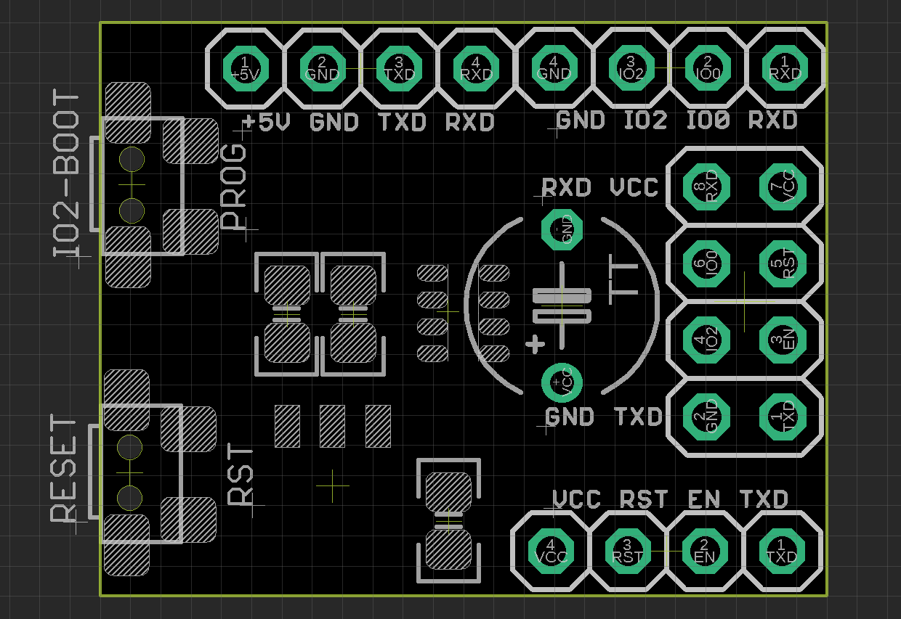
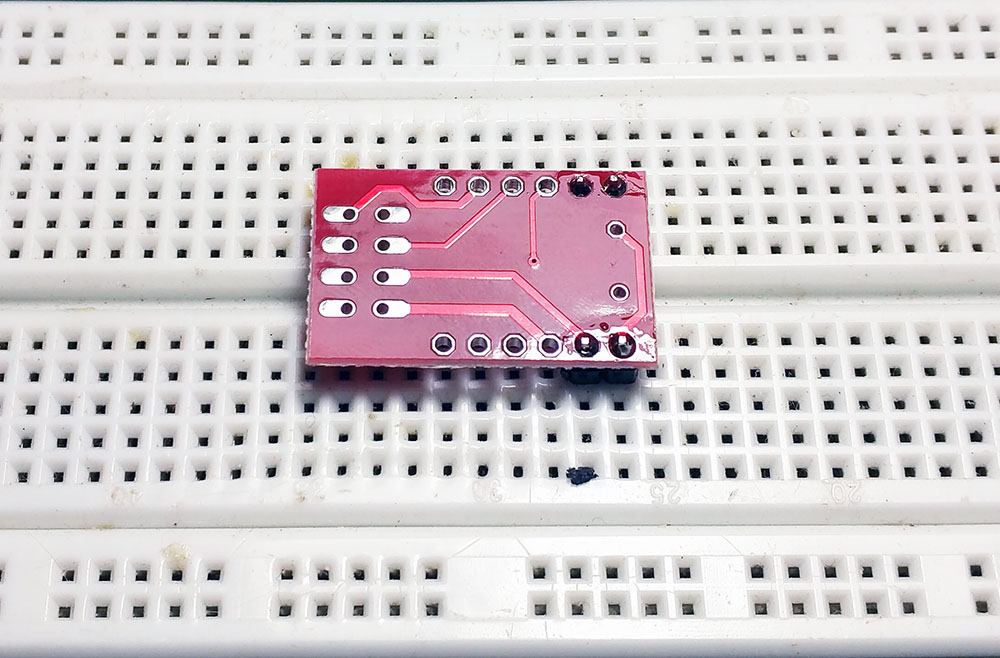
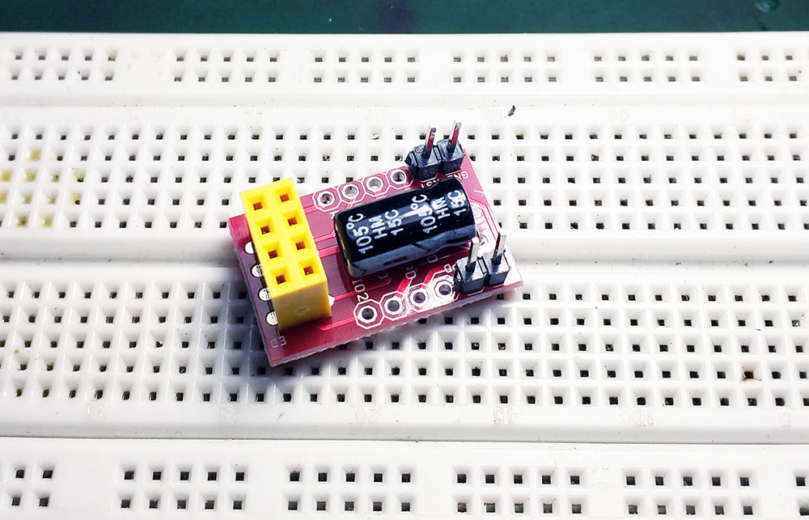
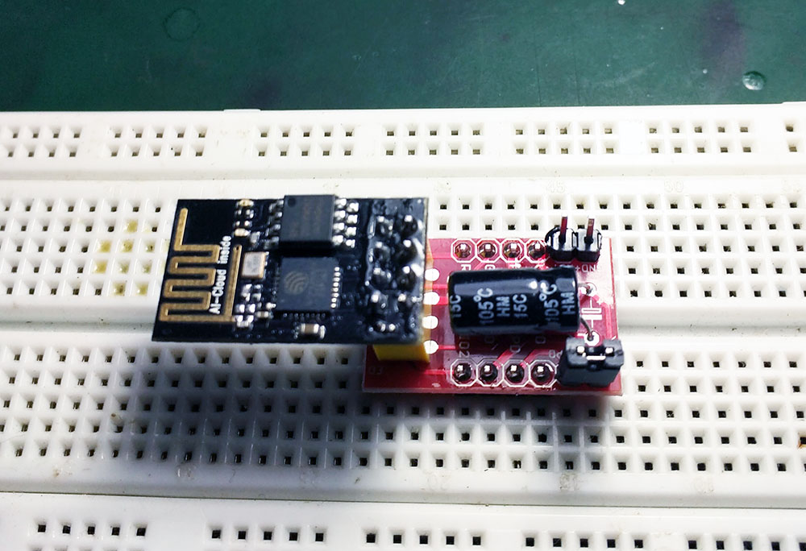
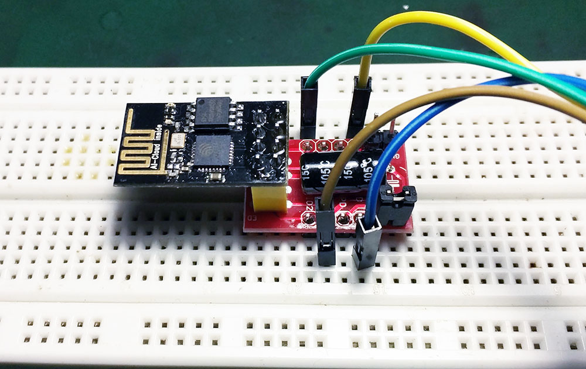

# NWI1070-DAT 

### V2 Version

- Add onboard LDO regualtor AMS1117, input voltage can be 5V, provided stable power supply 
- Add pull up and pull down control resistors for booting, pin 0, 2, EN, RST
- tested working well for both ESP-01 or ESP-01S
- Two booting control buttons, hold down IO button and press RST button to enter into flash mode.
- Lead all pins 2*4 out to breadboard

### V1 version 

#### Note:
- This board is a kit, NOT soldered, you must soldered by yourself.
- NOT include ESP-01 Board

#### Features:

- Lead all pins 2*4 out to breadboard
- One group of pin to connect VCC with CHPD to enable the module, by jumper
- One group of pin to connect RST with GND when you want to reset the module, by jumper
- On board current capacitor 220UF
- Only need a USB-TTL tool like CH340 breakout board to connect ESP-01: TX, RX, VCC, GND

Please follow the soldering steps below to solder, otherwise the small board maybe a little difficult to do:

