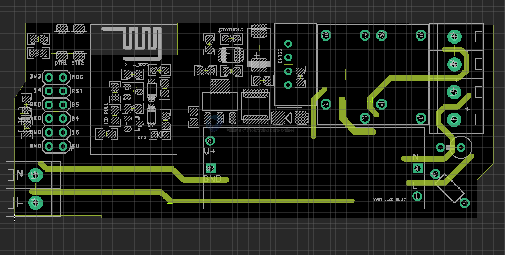

# NWI1072-dat 

- https://www.electrodragon.com/product/wifi-iot-relay-board-based-esp8266/

- used devices [[OPM1110-dat]] - [[relay-dat]]

## board map 

- BTN1 = IO0
- BTN2 = IO2, also on-module LED 
- IO4 / IO5 pull-up by resistors 
- on-board LED IO16
- reserved DHT22 temperature socket - [[STH1010-dat]] - [[1-wire-dat]] read by pin IO14

## Use guide :

- Please connect the board to sensor by wires, because the PCB and relays will generate heats!! 1-2 degree higher!!
- The board has exposed high voltage AC connection, be very carefully on this.
- Please notice the two relay output terminals are a little conflict with case, second channels need to use soft wires or remove the screw installation bars manually.

## Inductive Load 

For inductive load (motor-type) alternative:

This is a generate relay board, which may cause restarting when use it drive the inductive loads, please use the following alternative.

- [Added kickback EMC board](https://www.electrodragon.com/product/2pcs-ac-kickback-absorb-board-inductive-load/) near your load, this can solve the problem, but more extra wiring.
- [Use relay board version IL](https://www.electrodragon.com/product/esp-relay-board-il-inductive-load/), which is specially for this, tested by us and some other customers.
- [Use relay board version SPDT](https://www.electrodragon.com/product/wifi-iot-relay-board-spdt-based-esp8266/), which the AC main power not passed through the input of the board to output, no interferance.

Read more about inductive laod here [[inductive-load-dat]]

## ref 

- [[esp-relay-board-dat]] - [[ESP-SDK-dat]] 

- [[acdc-dat]]

- [[NWI1072]]