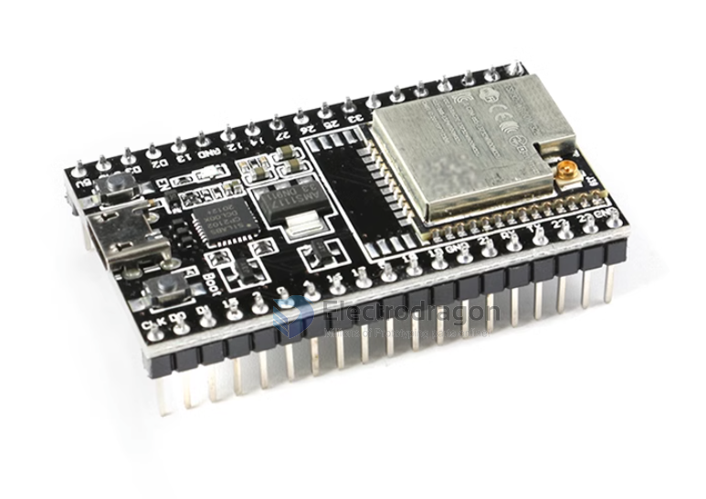
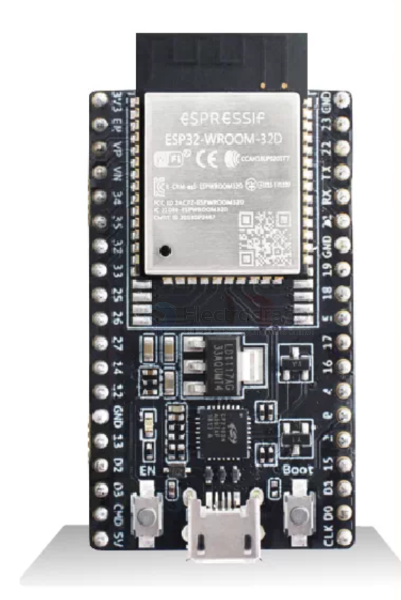
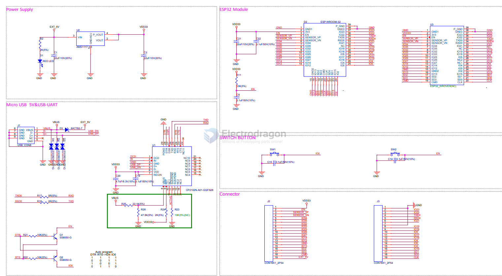
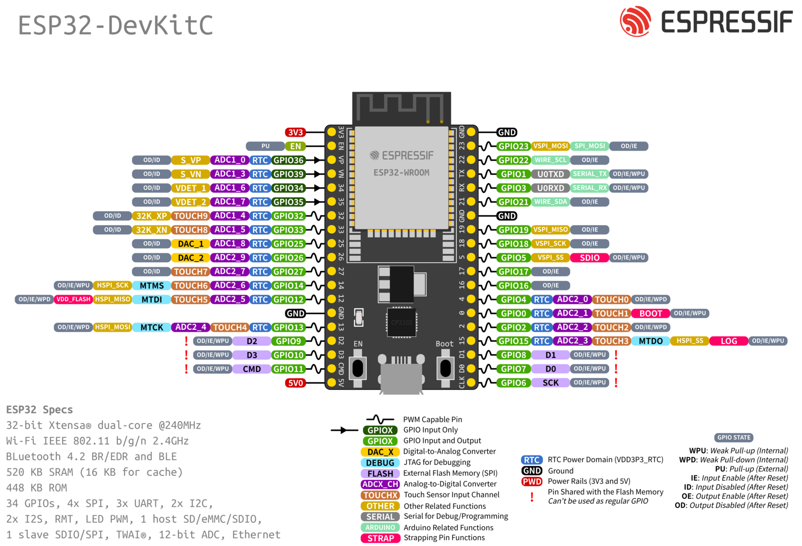
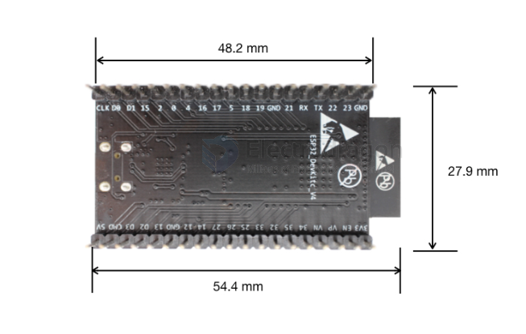
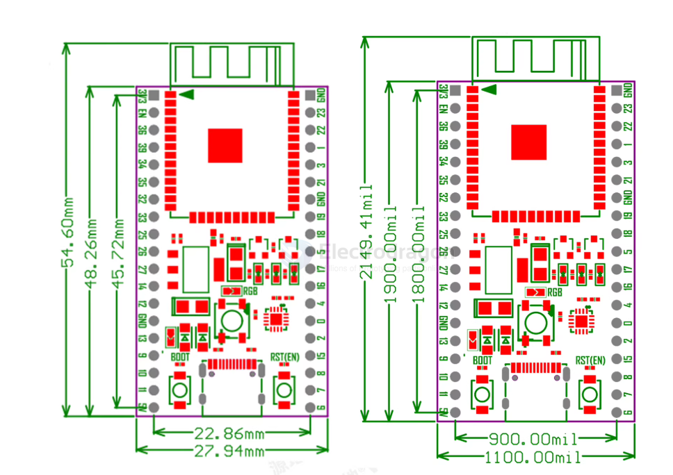
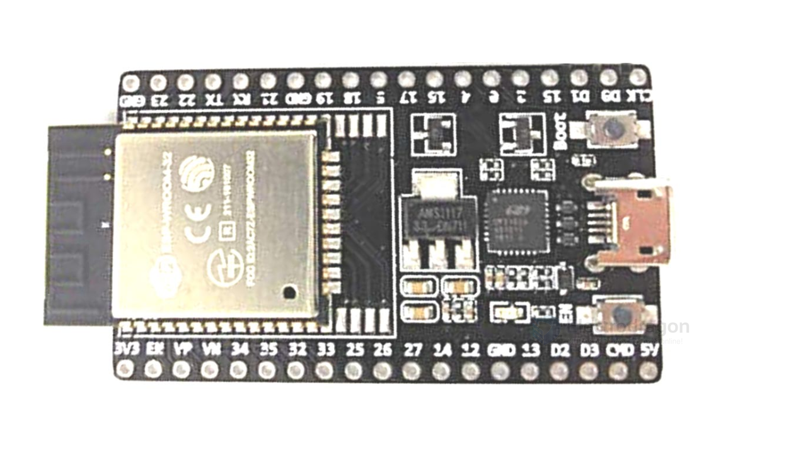
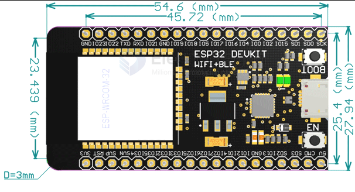
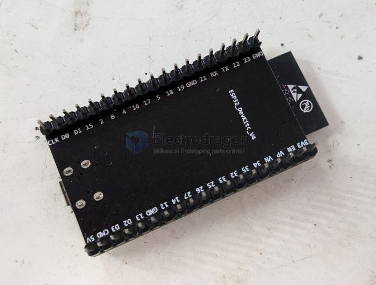

# NWI1100-dat 

- [[esp32-module-clone-dat]]

- [[NWI1100-dat]] - [[NWI1101-dat]] - [[ESP32-dat]] - [[ESP32-board-dat]] - [[ESP32-dev-board-dat]]

board - [[NWI1100-dat]] - [[NWI1101-dat]] - [[NWI1102-dat]] - [[NWI1103-dat]]

ESP32-DevKitC

[product url - ESP32 Mini Core Dev. Board, ESP32-DevKitC, V4 [Ver.]](https://www.electrodragon.com/product/esp32-devkitc/)

legacy wiki page

- https://w.electrodragon.com/w/Category:ESP32#Specification_and_ordering_information

- https://w.electrodragon.com/w/ESP32#Documents

- broken link - https://www.espressif.com.cn/en/support/download/documents?keys&field_type_tid%5B%5D=13

- clone version please see here - [[ESP32-module-clone-dat]]

## Schematic 

- power supply 
- microUSB + USB-TTL
- buttons *2
- pin header 
- EN pull-up
- power supply filter capacitor *2 

## Pin 

pin == 2x19 

| L_assigned | left | right | R_assigned |
| ---------- | ---- | ----- | ---------- |
|            | 3V3  | GND   |            |
|            | en   | 23    |            |
|            | 36   | 22    |            |
|            | 39   | TXD0  |            |
|            | 34   | RXD0  |            |
|            | 35   | 21    |            |
|            | 32   | gnd   |            |
|            | 33   | 19    |            |
|            | 25   | 18    |            |
|            | 26   | 5     |            |
|            | 27   | 17    |            |
|            | 14   | 16    |            |
|            | 12   | 4     |            |
|            | gnd  | 0     |            |
|            | 13   | 2     |            |
|            | 9    | 15    |            |
|            | 10   | 8     |            |
|            | 11   | 7     |            |
|            | +5V  | 6     |            |

## dimension 

## physical board 

## version check 

- Please make sure to use original version, otherwise the pin mapping and quality is not the same 
- otherwise you may have problem to use it other stackable boards, like [[IDD1016-dat]]

## ref 

- [[NWI1100]] 

- [[power-dat]] - [[serial-dat]]