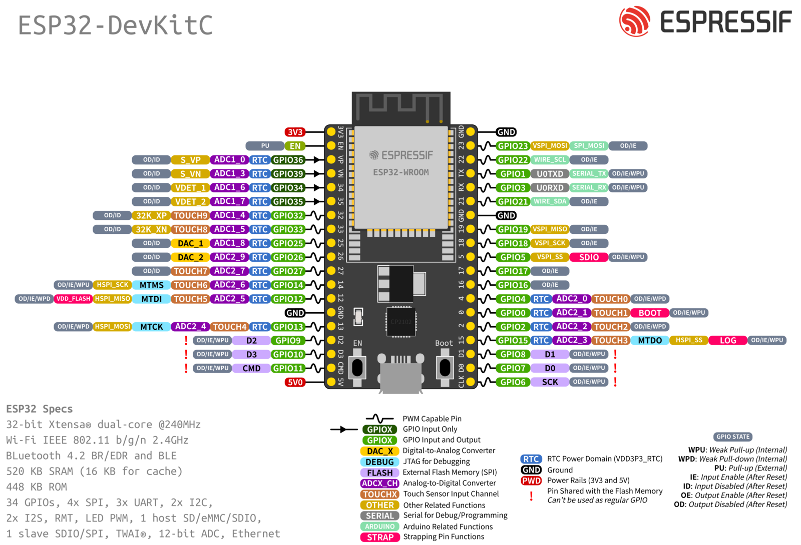
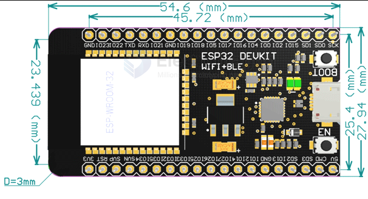

# NWI1100 dat 

ESP32-DevKitC

## Schematic 

- power supply 
- microUSB + USB-TTL
- buttons *2
- pin header 
- EN pull-up
- power supply filter capacitor *2 

## Pin 

| L_assigned | left | right | R_assigned |
| ---------- | ---- | ----- | ---------- |
|            | en   | 23    |            |
|            | 36   | 22    |            |
|            | 39   | TXD0  |            |
|            | 34   | RXD0  |            |
|            | 35   | 21    |            |
|            | 32   | gnd   |            |
|            | 33   | 19    |            |
|            | 25   | 18    |            |
|            | 26   | 5     |            |
|            | 27   | 17    |            |
|            | 14   | 16    |            |
|            | 12   | 4     |            |
|            | gnd  | 0     |            |
|            | 13   | 2     |            |
|            | 9    | 15    |            |
|            | 10   | 8     |            |
|            | 11   | 7     |            |
|            | +5V  | 6     |            |

## ref 

- [[NWI1100]] 

- [[power-dat]] - [[serial-dat]]