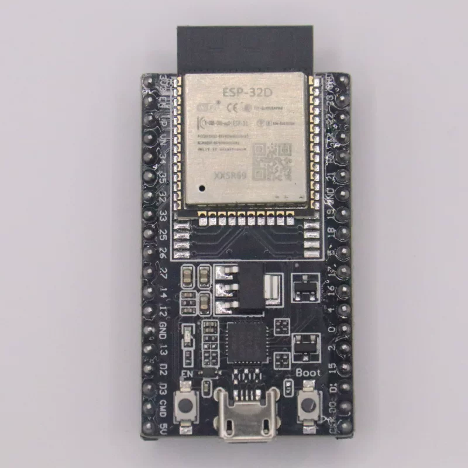

# NWI1101-dat

board - [[NWI1100-dat]] - [[NWI1101-dat]] - [[NWI1102-dat]] - [[NWI1103-dat]]

[product url - ESP32 Mini Core Dev. Board, ESP32-DevKitC, V4 [Ver.]](https://www.electrodragon.com/product/esp32-devkitc/)

- clone version of [[NWI1100-dat]]

- [[esp32-module-clone-dat]]

- [[NWI1100-dat]] - [[NWI1101-dat]] - [[ESP32-dat]] - [[ESP32-board-dat]] - [[ESP32-dev-board-dat]]

## board map 

## ref 

- [[esp32-modules-dat]] - [[espressif-dat]]

- [[NWI1101]]