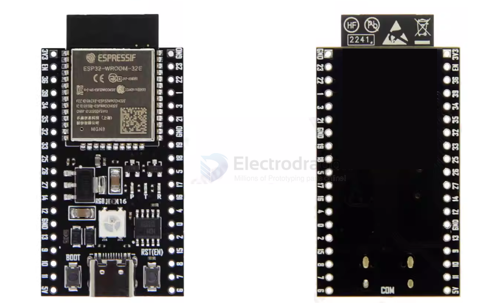

# NWI1102-dat

## Info

board - [[NWI1100-dat]] - [[NWI1101-dat]] - [[NWI1102-dat]] - [[NWI1103-dat]]

[product url - ESP32 Mini Core Dev. Board, ESP32-DevKitC, V4 [Ver.]](https://www.electrodragon.com/product/esp32-devkitc/)

### Board Map, Dimension, Pins, chip info, Use Guide, Setup Jumper, etc.

module - [[ESP32-wroom-dat]] == `ESP32-WROOM-32E `

pin definitions, dimensions refer to general genius board - [[NWI1100-dat]]

- `N8R2 （8M flash / 2M PSRAM）` == default option 
- N8R8 （8M flash / 8M PSRAM）
- N16R8 （16M flash / 8M PSRAM）

AIIOT / dual Type-C USB port / W2812gb == [[WS2812-dat]] / high-speed USB-serial == [[CH340-dat]] or [[CH343-dat]] (default) 

## Applications, category, tags, etc. 

## Demo Code and Video

## ref 

- [[NWI1102]] - [[NWI1101]]

- legacy wiki page 

