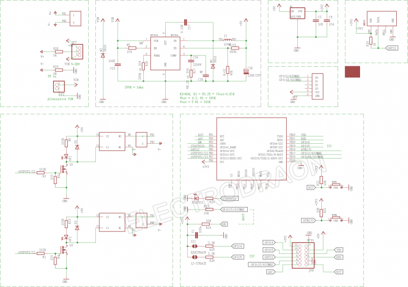
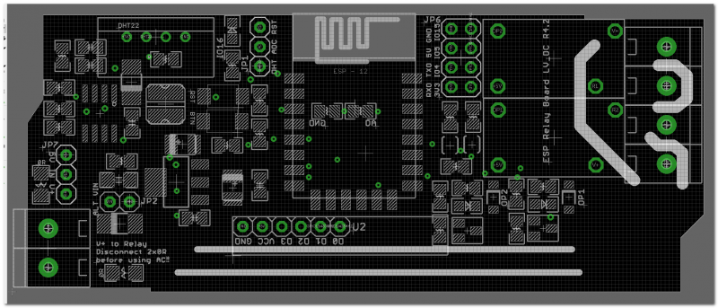
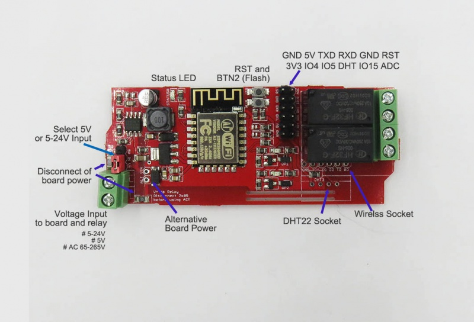
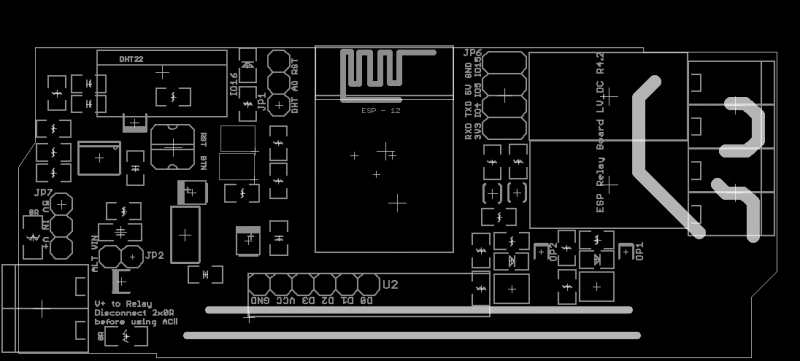

# NWI1115-dat

https://w.electrodragon.com/w/ESP_Relay_Board_VDC

## Analag Input A0

| Back Side Jumper | Header text                                                               |
| ---------------- | ------------------------------------------------------------------------- |
| Connect          | No voltage divider, A0 directly connect to ESP-12 Module ADC pin.         |
| Disconnect       | A0 input via voltage divider to ADC = 220K / 100K, maximium input A0 3.3V |

* Reference calculation see here: https://learn.sparkfun.com/tutorials/voltage-dividers/all

## Specific for Relay Board VDC

| Jumper                   | Header text                                                 | Header text           |
| ------------------------ | ----------------------------------------------------------- | --------------------- |
| U2                       | wireless RF receiver, output TTL signal to ESP12F pins      | DO -> IO2, D1 -> IO15 |
| JP2                      | Alternative power supply pin 5V-24V, = terminal power input | -                     |
| JP7                      | Power input selection, choose between 5V or 5-24V.          | -                     |
| JP1                      | DHT, ADC, RST                                               | -                     |
| JP6                      | row 1: RXD, TXD, 5V, GND, row 2: 3.3V, IO4, IO5, IO15       | -                     |
| Green Out Input Terminal | VIN 5-26V / ground                                          | -                     |

## Use of AC Main Power IN to Relay

* to switch to control AC mains power, need to remove two 1206 0R resistors on board. Then power from left green terminal = relay output (and terminal)
* To supply power on board control circuit, add 6-24V power to "ALT VIN" pins

## Schematic 

## version updates 

* V4.2 added voltage divider on back side of PCB, this need to be soldered manually.
* V4.1 pin headers changed to two group. RST, ADC and DHT_IO16 pins on left side now.

## ref 

- [[esp-relay-board-dat]]

- [[MP1584-dat]]