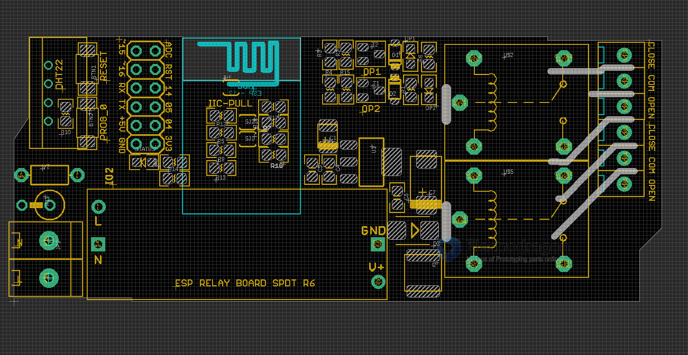

# NWI1118-DAT

- new version please see at page [[NWI1119-dat]]

### hardware 

#### R6 
- IO2 = status LED (also on module ESP-12F)
- IO0 = BTN2
- RST = BTN1

#### R5 

- IO2 = BTN1
- IO0 = BTN2

- IO13 = relay 1
- IO12 = relay 2 
- IO14 = IO14
- IO16  = status LED
- IO4, IO5 = I2C Pull up 

## installation 

- https://t.me/electrodragon3/319

## ref 

- [[ESP-SDK-dat]]

- [[esp-relay-board-dat]]

- [[ESP-12F-DAT]] - [[ESP32-­C3-­WROOM-­02-DAT]]
- [[ACDC-SM]]
- code reference - [[NWI1139-DAT]]

- [[NWI1118]]