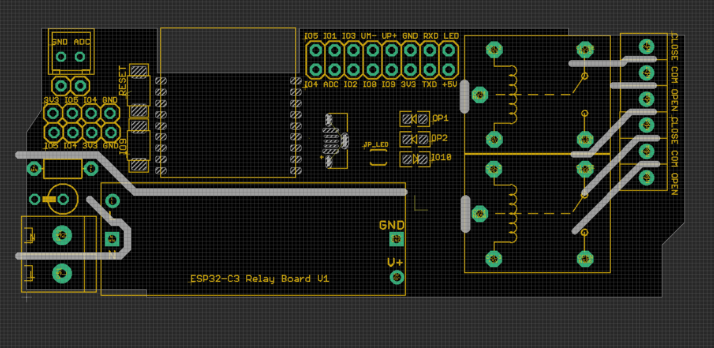
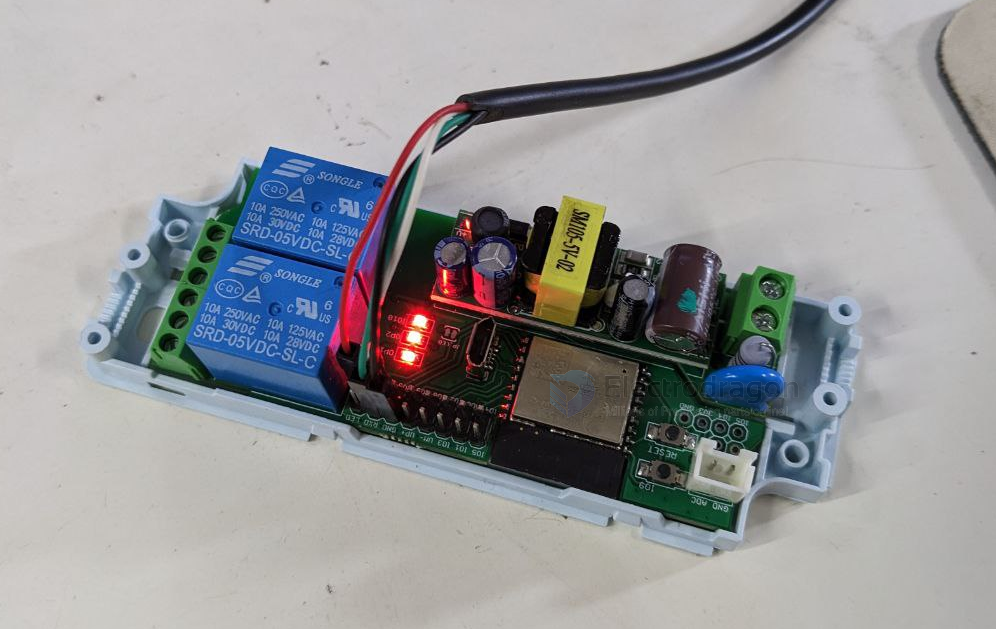

# NWI1119

- R7 ESP32-C3 Version

## hardware 

### Pin Definitions

| Pin       | Function                          | Note       |
| --------- | --------------------------------- | ---------- |
| IO0       | ADC sensing, XH2.54 Jack Port     |            |
| IO2 / IO8 | Setup for booting                 | pull-up    |
| IO4 / IO5 | Reserved for I2C, 1\*4 pin header | pull-up    |
| IO6 / IO7 | relay 1 / 2                       |            |
| IO09      | programmerable / Flash Button     |            |
| IO10      | programmerable LED                | via jumper |

### functions 

ADC port  - [[ADC-dat]]

### demo video

- https://www.youtube.com/watch?v=6Zk3WIVSvyM
- https://twitter.com/electro_phoenix/status/1622874731493072897
- https://t.me/electrodragon3/228

    const char *ssid = "electrodragon";
    const char *password = "electrodragon";

### ref

Tested with arduino code, flash tested with ESPHome, but not further function tests

- [[ESP-SDK-dat]] - [[ESP32-C3-WROOM-02-DAT]] - [[ESP32-dat]]

- [[esp-relay-board-dat]]

- [[NWI1119]]

- [[OPM1041-dat]] - [[OPM1110-dat]] 

- [[ACDC-dat]]