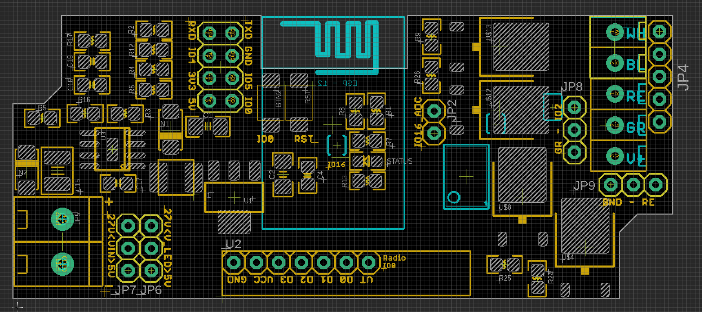
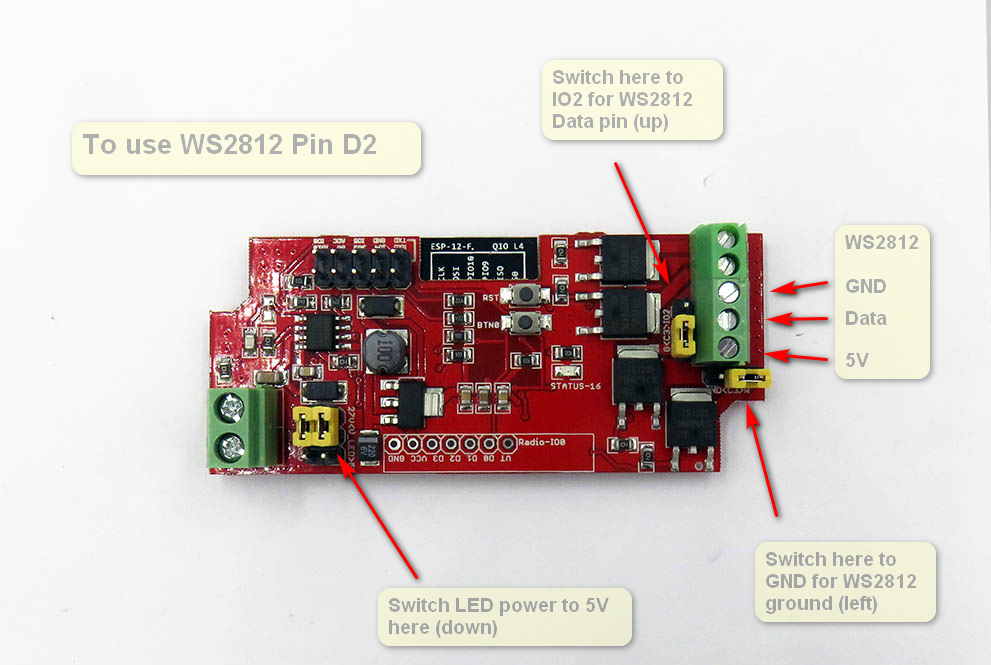
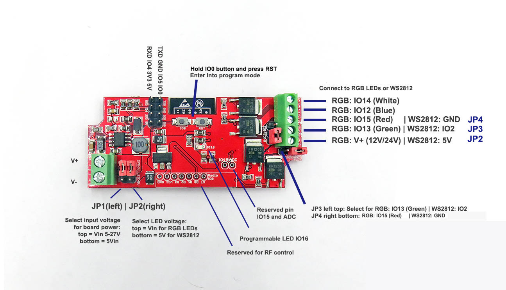
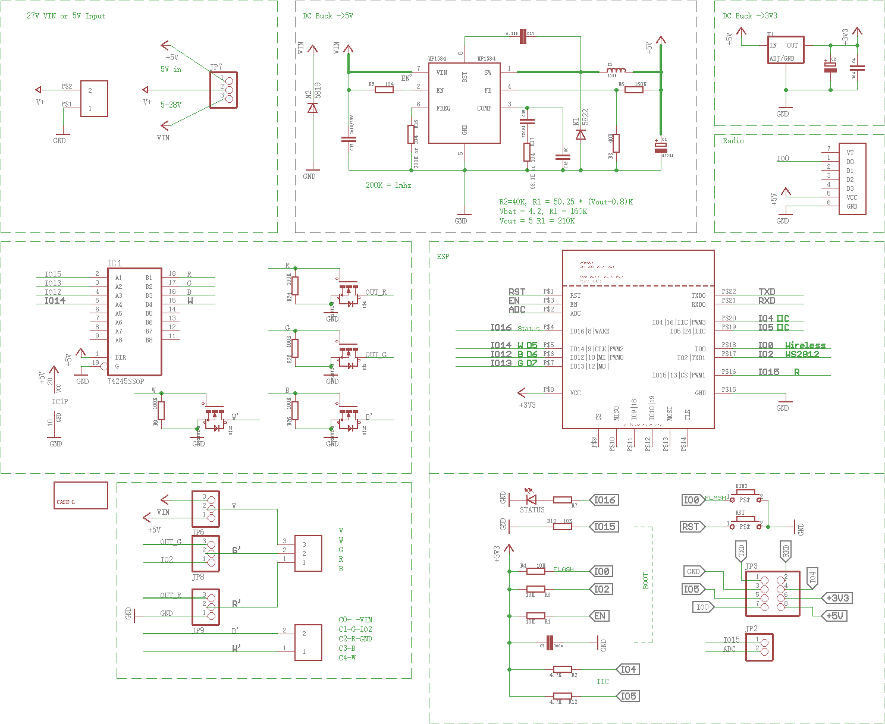

# NWI1124 DAT

## Setup Scenarios

| Target                       | Power Supply Input       | JP6 (strip power) | JP7 (board power) | JP8 | JP9 |
| ---------------------------- | ------------------------ | ----------------- | ----------------- | --- | --- |
| 5V WS2812 LED Strips         | 5-27V                    | 5V                | VIN               | IO2 | GND |
| 5V WS2812 LED Strips         | 5V                       | 5V                | 5V                | IO2 | GND |
| 5V WRGB 4ch LED Strips       | 5-27V                    | 5V                | VIN               | GR  | RE  |
| 5V WRGB 4ch LED Strips       | 5V                       | 5V                | 5V                | GR  | RE  |
| 12 / 24V WS2812 LED Strips   | 12V or 24V corresponding | VIN               | VIN               | GR  | RE  |
| 12 / 24V WRGB 4ch LED Strips | 12V or 24V corresponding | VIN               | VIN               | GR  | RE  |

* Note1: **12 / 24V WRGB 4ch LED Strips** is the default option which set on the board

### Setup Explantion V2

## Schematic

### Frontside Other Jumpers

- output JP4 only use pin 3-5 from top to bottom: GND, DAT_5V, 5V

### Backside Jumper

- SJ1+SJ2 set IO2 via logic shifter to 5V output for WS2812 signal
- SJ3 = IO16 LED connection control

## Accessories

- Reserved pins for our RF-LINK EDRF2 module here. (one channel trigger IO0 Low)
- https://www.electrodragon.com/product/rf-switch-receiver-433315mhz-wdecoder/

## Demos

- https://www.youtube.com/watch?v=_kBS72xQPqQ

## ref

- [[nwi1124]]
- old wiki link: https://www.electrodragon.com/w/ESP_Light

- [[NWI1124-DAT]] - [[NWI1125-DAT]] - [[NWI1126-DAT]]
