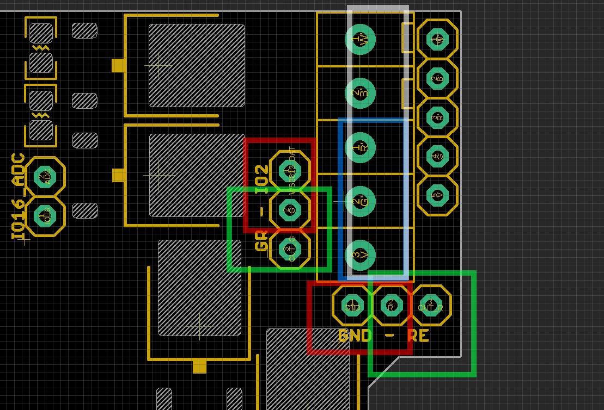

# NWI1124 DAT

## Pin Definitions 

### Setup Explantion V2

### Jumpers of Output Signal Setup 

based on above image, top pin 1 to bottom pin 5: 

#### Set both **RED** box jumpers for WS2812 output

- pin 4 to IO2 for WS2812 data
- pin 3 to GND
- Output pins from top to bottom (blue marked box pin 3-5)
  - WS2812_GND
  - WS2812_DAT (5V Logic) -> IO2
  - WS2812_VCC (can be set to 5V or VIN)

#### Set both **GREEN** box jumpers for WRGB output

- pin 4 to Green channel of RGBW
- pin 3 to Red   channel of RGBW
- Output pins from top to bottom (blue marked box pin 1-5)
  - White -> IO14
  - Blue -> IO12
  - Red -> IO15
  - Green -> IO13
  - VIN Voltage Supply

### Jumpers of Power Supply Setup 

Green Box: 

- Set the input power supply for board. 
- choose 5V if input power is 5V, bypass the on board DC/DC converter
- Choose ~27V if input power is higher than 5V

Red Box: 

- Set to up to ~27V for RGBW LED Strips
- Set to 5V for WS2812 LED Strips

## Setup Scenarios 

1. For 5V WS2812 LED Strips, power supply 5-27V
- JP7 set to VIN (5-27V, board power supply)
- JP6 set to 5V (led strip's power supply)
- JP8 set to IO2
- JP9 set to GND
- output JP4 only use pin 3-5 from top to bottom: GND, DAT_5V, 5V

2. For 5V WS2812 LED Strips, power supply 5V
- JP7 set to 5V (board power supply)
- JP6 set to 5V (led strip's power supply)
- JP8 set to IO2
- JP9 set to GND
- output JP4 only use pin 3-5 from top to bottom: GND, DAT_5V, 5V

3. For 12V or 24V WS2812 LED Strips, power supply 5-27V (not yet test confirm !)
- JP7 set to VIN (5-27V, board power supply)
- JP6 set to VIN (5-27V, led strip's power supply)
- JP8 set to IO2
- JP9 set to GND
- output JP4 only use pin 3-5 from top to bottom: GND, DAT_5V, ~27V

4. For 12V or 24V WRGB 4ch LED Strips, power supply 5-27V
- JP7 set to VIN (5-27V, board power supply)
- JP6 set to VIN (5-27V, led strip's power supply)
- JP8 set to GR
- JP9 set to RE
- output JP4 pins: White, Blue, Red, Green, VIN (5-27V, led strip's power supply)

5. For 5V WRGB 4ch LED Strips, power supply 5V
- JP7 set to 5V (board power supply)
- JP6 set to 5V (led strip's power supply)
- JP8 set to GR
- JP9 set to RE
- output JP4 pins: White, Blue, Red, Green, 5V (led strip's power supply)

## Schematic 

## Accessories 
- Reserved pins for our RF-LINK EDRF2 module here. (one channel trigger IO0 Low)
- https://www.electrodragon.com/product/rf-switch-receiver-433315mhz-wdecoder/

## Demos 
- https://www.youtube.com/watch?v=_kBS72xQPqQ

## ref 
- [[nwi1124]]
- old wiki link: https://www.electrodragon.com/w/ESP_Light

- [[NWI1124-DAT]] - [[NWI1125-DAT]] - [[NWI1126-DAT]]